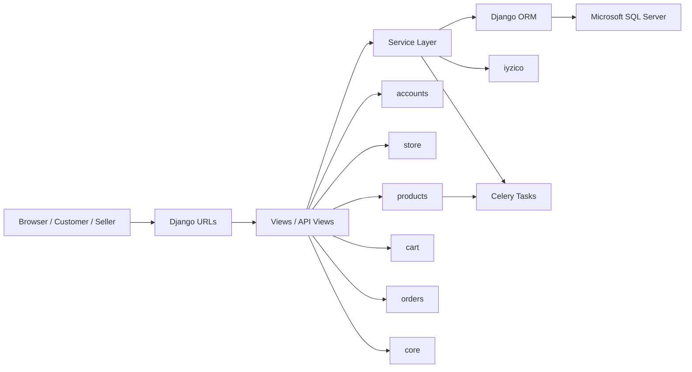

# Multi-Vendor E-Commerce Platform

A Django-based multi-vendor e-commerce platform developed as a portfolio project to gain practical experience with Django backend architecture and real-world e-commerce workflows.

> **Project Status:** Active development  
> The core e-commerce architecture is implemented. Several additional features and UI refinements are planned before the project is considered complete.

## Overview

This project is designed around a multi-vendor marketplace model where multiple stores can sell products through a shared product catalog.

The application covers customer, seller, catalog, cart, checkout, order, payment, shipping, cancellation, refund, and seller-management workflows.

A major focus of the project is backend architecture rather than only building individual pages. Business logic is separated into service classes where appropriate, and the project includes transaction handling, stock reservation, concurrency control, authorization checks, payment verification, and idempotent payment operations.

## Key Features

### Customer

- Account registration and authentication
- Email or phone number login
- Address management
- Product and category browsing
- Product detail pages with seller offers
- Buy Box support
- Product search, filtering, and sorting
- Product questions and answers
- Shopping cart
- Guest cart and guest-to-user cart merge
- Price-change detection in cart
- Checkout and order creation
- Order history
- Order success/failure flows

### Seller

- Seller onboarding and approval flow
- Seller profile management
- Store creation and management
- Store ownership authorization
- Product creation and multi-step product publishing
- Product variants and attributes
- Product image management
- Seller offers with price and stock
- Inventory management
- Store-specific product offers
- Seller order management
- Invoice handling
- Shipping and tracking workflows
- Order cancellation and refund flows
- iyzico marketplace submerchant onboarding

### Product Catalog

- Shared global product catalog
- Product / ProductVariant / StoreProduct structure
- EAV-style product attributes
- Product drafts
- Duplicate product detection and matching
- Seller product contributions
- Product collections
- Product questions, answers, and upvotes
- Buy Box logic
- Product publishing services

### Cart

The cart domain is handled through `CartService`, keeping cart business logic separate from HTTP concerns.

The cart layer includes:

- Add, remove, and update cart items
- Item selection
- Guest carts
- Guest-to-user cart merge
- Price-change tracking
- Checkout validation
- Stock availability checks
- Deterministic locking during stock validation

### Checkout & Orders

- Checkout validation before order creation
- Order snapshot data for historical accuracy
- Multi-vendor order splitting
- `Order` → `SubOrder` → `OrderItem` structure
- Stock reservations
- Reservation lifecycle management
- Guest checkout support
- Address and product information snapshots
- Order-level and seller-level workflows

A multi-vendor order is split into separate `SubOrder` records based on the seller/store.

### Payments

The payment layer integrates with iyzico and includes:

- iyzico 3DS payment initialization
- 3DS completion callback
- iyzico webhook handling
- Webhook signature verification
- Payment response validation
- Payment transaction tracking
- Stored card support
- Idempotency handling
- Payment/order consistency checks
- Refund processing
- iyzico marketplace submerchant integration

The application does not store raw card PAN/CVC data as a local payment record.

## Architecture

The project follows a Django monolith architecture with a dedicated service layer for business logic.



### Architectural Principles

- Django handles HTTP, authentication, routing, templates, and API endpoints.
- Business logic is moved into services where the flow becomes complex.
- Database operations use Django ORM.
- `transaction.atomic()` is used for operations that must be committed atomically.
- `select_for_update()` is used where database row locking is required for concurrency-sensitive flows.
- Payment provider HTTP calls are kept outside long database transactions.
- Ownership and seller authorization checks are applied to seller-specific resources.
- Payment callbacks and webhooks use verification and idempotent finalization logic.

Detailed architecture documentation is available in [`docs/architecture.md`](docs/architecture.md).

## Multi-Vendor Model

The main marketplace relationship can be summarized as:

```text
Product
   ↓
ProductVariant
   ↓
StoreProduct
   ↓
Store
```

A `Product` represents the shared catalog item.

A `ProductVariant` represents a purchasable variation of that product.

A `StoreProduct` represents a seller's offer for a specific variant, including seller-specific information such as price and stock.

This separation allows multiple stores to sell the same catalog product while maintaining their own offers.

## Technology Stack

| Technology | Current Version | Purpose |
|---|---:|---|
| Python | — | Programming language |
| Django | 5.2.6 | Backend web framework |
| Microsoft SQL Server | — | Relational database |
| `mssql-django` | 1.8.0 | Django SQL Server backend |
| `pyodbc` | 5.2.0 | SQL Server database connectivity |
| Celery | 5.6.3 | Asynchronous/background task infrastructure |
| iyzico / `iyzipay` | 1.0.46 | Payment provider and marketplace integration |
| Pillow | 12.2.0 | Image processing |
| `django-crispy-forms` | 2.4 | Form rendering |
| `python-decouple` | 3.8 | Environment configuration |
| ngrok | — | Local webhook/callback tunneling |

## Security & Reliability

The project includes several backend reliability and security mechanisms:

- Custom authentication backend for email/phone login
- Authentication and seller authorization checks
- Store ownership validation
- CSRF protection
- iyzico 3DS signature verification
- iyzico webhook signature verification
- Payment amount and currency validation
- Database transactions
- Row-level locking for concurrency-sensitive operations
- Stock reservation state management
- Idempotent payment finalization
- Refund idempotency
- Database constraints for important invariants
- Separation of external provider calls from database transactions
- Protection against unauthorized access to seller resources and orders

See [`docs/security.md`](docs/security.md) for the detailed security and concurrency documentation.

## Documentation

The detailed documentation is written in Turkish and organized by system area.

> The links below assume the documentation from the previous development phases has been consolidated into the repository's common `docs/` directory.


### Architecture

- [`docs/architecture.md`](docs/architecture.md)
- [`docs/diagrams/system-architecture.md`](docs/diagrams/system-architecture.md)
- [`docs/diagrams/request-lifecycle.md`](docs/diagrams/request-lifecycle.md)
- [`docs/diagrams/service-layer.md`](docs/diagrams/service-layer.md)
- [`docs/diagrams/external-integrations.md`](docs/diagrams/external-integrations.md)

### Database

- [`docs/database.md`](docs/database.md)
- [`docs/diagrams/database-er.md`](docs/diagrams/database-er.md)
- [`docs/diagrams/identity-store-er.md`](docs/diagrams/identity-store-er.md)
- [`docs/diagrams/catalog-core-er.md`](docs/diagrams/catalog-core-er.md)
- [`docs/diagrams/product-engagement-er.md`](docs/diagrams/product-engagement-er.md)
- [`docs/diagrams/cart-er.md`](docs/diagrams/cart-er.md)
- [`docs/diagrams/order-er.md`](docs/diagrams/order-er.md)
- [`docs/diagrams/payment-er.md`](docs/diagrams/payment-er.md)

### Cart

- [`docs/cart.md`](docs/cart.md)
- [`docs/diagrams/cart-architecture.md`](docs/diagrams/cart-architecture.md)
- [`docs/diagrams/cart-sequences.md`](docs/diagrams/cart-sequences.md)

### Product & Multi-Vendor

- [`docs/product-multivendor.md`](docs/product-multivendor.md)
- [`docs/diagrams/product-multivendor-architecture.md`](docs/diagrams/product-multivendor-architecture.md)
- [`docs/diagrams/product-publishing-sequence.md`](docs/diagrams/product-publishing-sequence.md)
- [`docs/diagrams/buybox-sequence.md`](docs/diagrams/buybox-sequence.md)
- [`docs/diagrams/product-architecture-components.md`](docs/diagrams/product-architecture-components.md)

### Checkout & Orders

- [`docs/checkout-order.md`](docs/checkout-order.md)
- [`docs/diagrams/checkout-order-architecture.md`](docs/diagrams/checkout-order-architecture.md)
- [`docs/diagrams/checkout-sequence.md`](docs/diagrams/checkout-sequence.md)
- [`docs/diagrams/order-lifecycle.md`](docs/diagrams/order-lifecycle.md)
- [`docs/diagrams/stock-reservation-sequence.md`](docs/diagrams/stock-reservation-sequence.md)
- [`docs/diagrams/multivendor-order-split.md`](docs/diagrams/multivendor-order-split.md)

### Payments & iyzico

- [`docs/payment.md`](docs/payment.md)
- [`docs/diagrams/payment-architecture.md`](docs/diagrams/payment-architecture.md)
- [`docs/diagrams/payment-3ds-sequence.md`](docs/diagrams/payment-3ds-sequence.md)
- [`docs/diagrams/payment-webhook-sequence.md`](docs/diagrams/payment-webhook-sequence.md)
- [`docs/diagrams/stored-card-sequence.md`](docs/diagrams/stored-card-sequence.md)
- [`docs/diagrams/refund-sequence.md`](docs/diagrams/refund-sequence.md)
- [`docs/diagrams/payment-data-model.md`](docs/diagrams/payment-data-model.md)

### Seller

- [`docs/seller.md`](docs/seller.md)
- [`docs/diagrams/seller-architecture.md`](docs/diagrams/seller-architecture.md)
- [`docs/diagrams/seller-onboarding-sequence.md`](docs/diagrams/seller-onboarding-sequence.md)
- [`docs/diagrams/store-lifecycle.md`](docs/diagrams/store-lifecycle.md)
- [`docs/diagrams/seller-authorization.md`](docs/diagrams/seller-authorization.md)
- [`docs/diagrams/seller-order-flow.md`](docs/diagrams/seller-order-flow.md)

### Security

- [`docs/security.md`](docs/security.md)
- [`docs/diagrams/security-architecture.md`](docs/diagrams/security-architecture.md)
- [`docs/diagrams/concurrency-stock-reservation.md`](docs/diagrams/concurrency-stock-reservation.md)
- [`docs/diagrams/payment-idempotency.md`](docs/diagrams/payment-idempotency.md)
- [`docs/diagrams/webhook-security.md`](docs/diagrams/webhook-security.md)

## Project Structure

```text
.
├── accounts/
│   ├── services/
│   ├── models.py
│   ├── views.py
│   └── urls.py
│
├── cart/
│   ├── services/
│   ├── models.py
│   └── views/
│
├── core/
│   ├── models.py
│   ├── views.py
│   └── urls.py
│
├── ecommerce_project/
│   ├── settings.py
│   ├── urls.py
│   ├── asgi.py
│   └── wsgi.py
│
├── orders/
│   ├── services/
│   │   ├── order.py
│   │   ├── payment.py
│   │   ├── refund.py
│   │   ├── cancellation.py
│   │   ├── shipping.py
│   │   ├── invoice.py
│   │   └── stock_reservation.py
│   ├── models.py
│   ├── views.py
│   └── test/
│
├── products/
│   ├── services/
│   ├── forms/
│   ├── views/
│   ├── models.py
│   └── tasks.py
│
├── store/
│   ├── models.py
│   ├── views.py
│   └── forms.py
│
├── manage.py
├── requirements.txt
└── .env.example
```

## Installation

### 1. Clone the repository

```bash
git clone https://github.com/emredmir/E-Commerce.git
cd E-Commerce
```

### 2. Create a virtual environment

```bash
python -m venv venv
```

Activate it:

**Windows**

```bash
venv\Scripts\activate
```

**Linux / macOS**

```bash
source venv/bin/activate
```

### 3. Install dependencies

```bash
pip install -r requirements.txt
```

### 4. Configure Microsoft SQL Server

The project currently uses Microsoft SQL Server through `mssql-django` and `pyodbc`.

Make sure SQL Server is installed and running locally, and that the required SQL Server ODBC driver is available.

The current configuration uses:

```text
ODBC Driver 17 for SQL Server
```

### 5. Configure environment variables

Copy the example file:

```bash
copy .env.example .env
```

On Linux / macOS:

```bash
cp .env.example .env
```

Set the database and application values in `.env`.

The project also expects iyzico configuration values such as the API credentials, environment, and callback/public URLs.

Do not commit real API keys, secrets, database passwords, or other sensitive values to GitHub.

### 6. Run migrations

```bash
python manage.py migrate
```

### 7. Create a superuser

```bash
python manage.py createsuperuser
```

### 8. Start the development server

```bash
python manage.py runserver
```

The application will then be available at:

```text
http://127.0.0.1:8000/
```

## iyzico Webhook Development

The project is currently developed locally while iyzico webhook/callback flows are exposed through `ngrok`.

The general development flow is:

```text
Local Django Server
        ↓
      ngrok
        ↓
Public HTTPS URL
        ↓
iyzico Callback / Webhook
```

When the ngrok URL changes, the relevant public/callback and CSRF configuration must be updated accordingly.

This setup is intended for local development and testing, not as a production deployment architecture.

## Testing

The project includes both automated tests and manual browser testing.

Automated tests cover areas including:

- Cart behavior and cart cleanup
- Successful order creation
- Payment completion
- iyzico webhook payload and signature validation
- Payment finalization idempotency
- Order access control
- Cancellation flows
- Refund flows
- Partial and full refund scenarios
- Stock restoration and rollback behavior

Run the Django test suite with:

```bash
python manage.py test
```

In addition to automated tests, the application has been tested manually through the browser by executing real application flows such as account, cart, checkout, payment, seller, and order operations.

## Screenshots & Demo

Screenshots and a public demo are not included yet.

They will be added after the remaining features and UI refinements are completed.

## Development Approach

This project was developed as a portfolio project with two main goals: building a practical e-commerce application and gaining hands-on experience with Django backend architecture.

During development, I used AI-assisted tools as part of the development process. They were particularly useful for exploring architectural alternatives, debugging, reviewing code, identifying edge cases, and discussing implementation decisions. I also worked on the project by testing different approaches and refining the code as I learned more about Django and backend development.

The main purpose of the project was not only to build features, but also to gain practical experience with concepts such as service-layer architecture, database relationships, transactions, concurrency control, authentication and authorization, payment flows, idempotency, and multi-vendor order management.

## Planned Features

The next development steps include:

- Seller return flow
- Seller settlement
- Reservation expiry worker
- Product reviews
- Coupon and discount system
- UI and template refinements

After these features are completed, the project will move toward final UI polish, screenshots, and a public demo.

## Author

**GitHub:** [@emredmir](https://github.com/emredmir)

LinkedIn is available through the GitHub profile.

## License

No license has been selected for the project yet.
