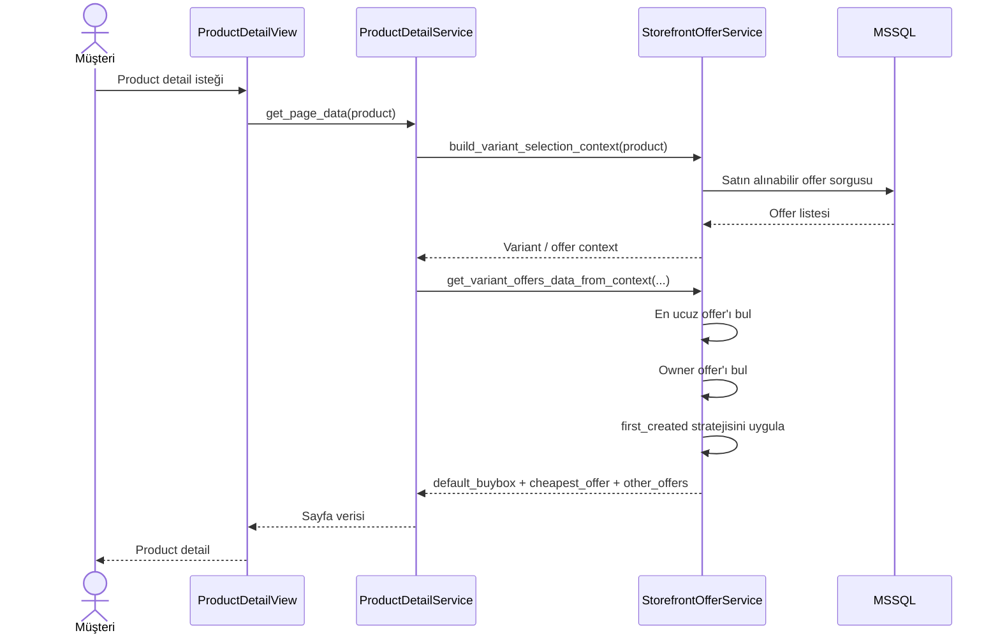
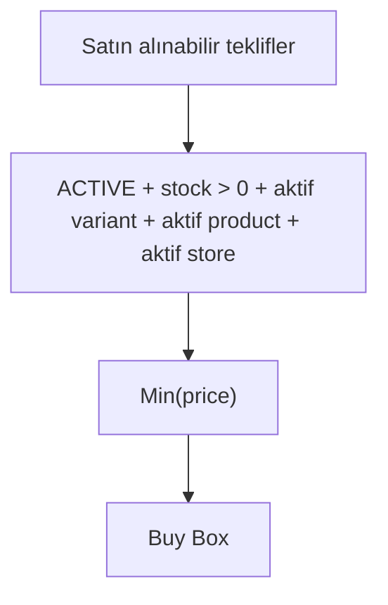
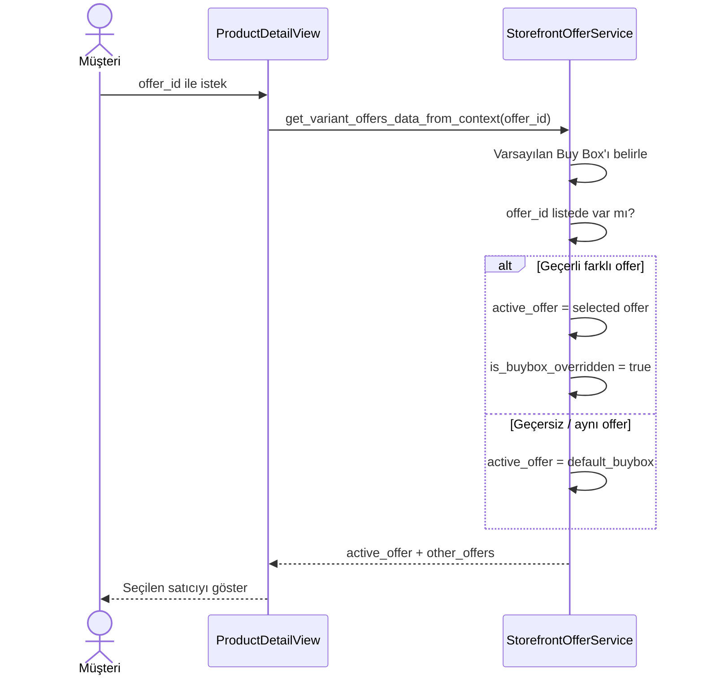

# Buy Box Sequence Diagramları

## Varsayılan Buy Box (`first_created`)

```mermaid
sequenceDiagram
    actor Customer as Müşteri
    participant View as ProductDetailView
    participant Detail as ProductDetailService
    participant OfferService as StorefrontOfferService
    participant DB as MSSQL

    Customer->>View: Product detail isteği
    View->>Detail: get_page_data(product)
    Detail->>OfferService: build_variant_selection_context(product)
    OfferService->>DB: Satın alınabilir offer sorgusu
    DB-->>OfferService: Offer listesi
    OfferService-->>Detail: Variant / offer context
    Detail->>OfferService: get_variant_offers_data_from_context(...)
    OfferService->>OfferService: En ucuz offer'ı bul
    OfferService->>OfferService: Owner offer'ı bul
    OfferService->>OfferService: first_created stratejisini uygula
    OfferService-->>Detail: default_buybox + cheapest_offer + other_offers
    Detail-->>View: Sayfa verisi
    View-->>Customer: Product detail
```

---

## En Ucuz Teklifi Buy Box Yapma (`lowest_price`)

```mermaid
flowchart TD
    O[Satın alınabilir teklifler]
    FILTER["ACTIVE + stock > 0 + aktif variant + aktif product + aktif store"]
    CHEAPEST["Min(price)"]
    BUYBOX[Buy Box]

    O --> FILTER
    FILTER --> CHEAPEST
    CHEAPEST --> BUYBOX
```

---

## Müşterinin Başka Satıcıyı Seçmesi

```mermaid
sequenceDiagram
    actor Customer as Müşteri
    participant View as ProductDetailView
    participant Service as StorefrontOfferService

    Customer->>View: offer_id ile istek
    View->>Service: get_variant_offers_data_from_context(offer_id)
    Service->>Service: Varsayılan Buy Box'ı belirle
    Service->>Service: offer_id listede var mı?
    alt Geçerli farklı offer
        Service->>Service: active_offer = selected offer
        Service->>Service: is_buybox_overridden = true
    else Geçersiz / aynı offer
        Service->>Service: active_offer = default_buybox
    end
    Service-->>View: active_offer + other_offers
    View-->>Customer: Seçilen satıcıyı göster
```

