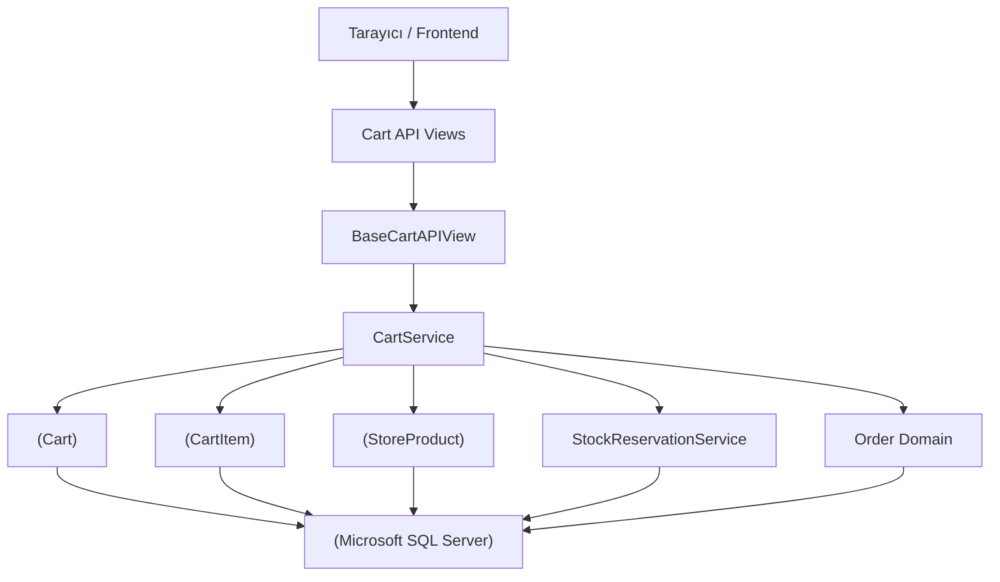
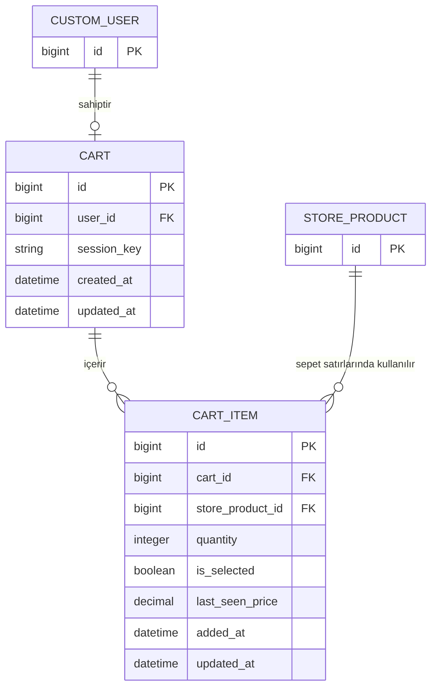
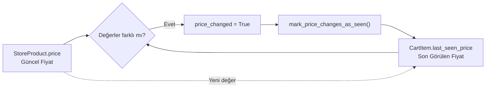

# Cart Architecture Diagramları

## 1. Katmanlı Mimari

```mermaid
graph TD
    CLIENT[Tarayıcı / Frontend]
    VIEW[Cart API Views]
    BASE[BaseCartAPIView]
    SERVICE[CartService]
    CART["(Cart)"]
    ITEM["(CartItem)"]
    OFFER["(StoreProduct)"]
    STOCK[StockReservationService]
    ORDER[Order Domain]
    DB["(Microsoft SQL Server)"]

    CLIENT --> VIEW
    VIEW --> BASE
    BASE --> SERVICE
    SERVICE --> CART
    SERVICE --> ITEM
    SERVICE --> OFFER
    SERVICE --> STOCK
    SERVICE --> ORDER
    CART --> DB
    ITEM --> DB
    OFFER --> DB
    STOCK --> DB
    ORDER --> DB
```

## 2. Cart Domain ER Özeti

```mermaid
erDiagram
    CUSTOM_USER ||--o| CART : "sahiptir"
    CART ||--o{ CART_ITEM : "içerir"
    STORE_PRODUCT ||--o{ CART_ITEM : "sepet satırlarında kullanılır"

    CART {
        bigint id PK
        bigint user_id FK
        string session_key
        datetime created_at
        datetime updated_at
    }

    CART_ITEM {
        bigint id PK
        bigint cart_id FK
        bigint store_product_id FK
        integer quantity
        boolean is_selected
        decimal last_seen_price
        datetime added_at
        datetime updated_at
    }

    STORE_PRODUCT {
        bigint id PK
    }

    CUSTOM_USER {
        bigint id PK
    }
```

## 3. Fiyat Modeli

```mermaid
graph LR
    SP["StoreProduct.price<br/>Güncel Fiyat"]
    CI["CartItem.last_seen_price<br/>Son Görülen Fiyat"]
    CHECK{Değerler farklı mı?}
    CHANGE["price_changed = True"]
    ACK["mark_price_changes_as_seen()"]

    SP --> CHECK
    CI --> CHECK
    CHECK -->|Evet| CHANGE
    CHANGE --> ACK
    ACK --> CI
    SP -.->|Yeni değer| CI
```
