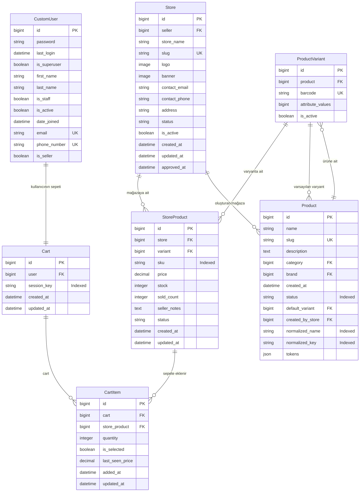

# Sepet ER Diyagramı

Bu diyagram, mevcut Django model tanımlarındaki alanları ve ilişkileri gösterir. Model ve alan isimleri kaynak kod ile aynıdır.

> Not: `CartItem.store_product` doğrudan `StoreProduct`'a bağlanır; sepet fiyatı ayrı bir fiyat alanı olarak tutulmaz. `last_seen_price` yalnızca kullanıcının gördüğü son fiyatı izlemek için kullanılan snapshot alanıdır.
