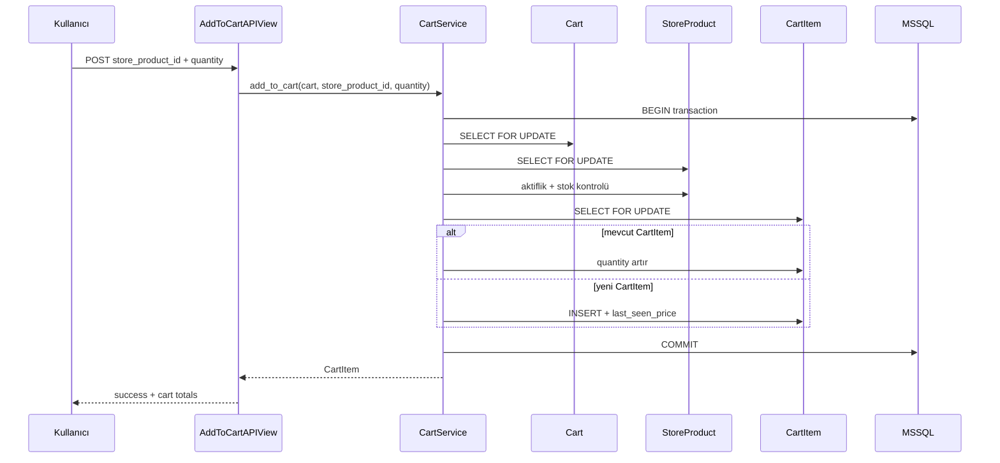
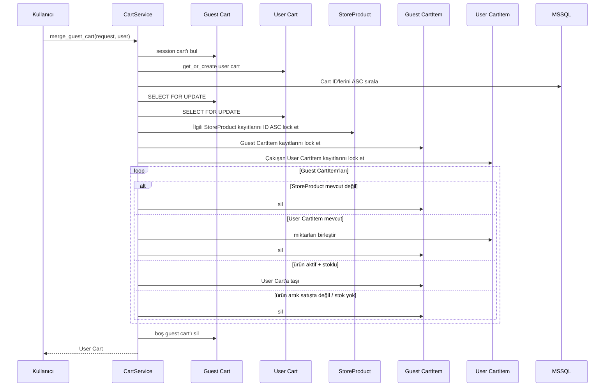
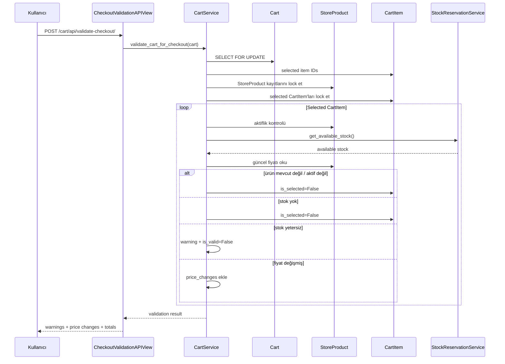
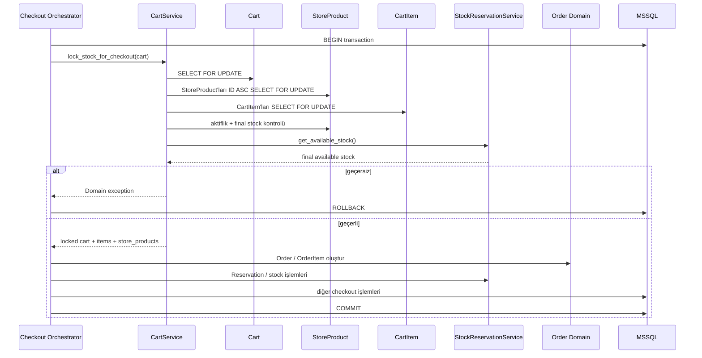

# Cart Sequence Diagramları

## 1. Sepete Ürün Ekleme

```mermaid
sequenceDiagram
    participant U as Kullanıcı
    participant V as AddToCartAPIView
    participant S as CartService
    participant C as Cart
    participant P as StoreProduct
    participant I as CartItem
    participant DB as MSSQL

    U->>V: POST store_product_id + quantity
    V->>S: add_to_cart(cart, store_product_id, quantity)
    S->>DB: BEGIN transaction
    S->>C: SELECT FOR UPDATE
    S->>P: SELECT FOR UPDATE
    S->>P: aktiflik + stok kontrolü
    S->>I: SELECT FOR UPDATE
    alt mevcut CartItem
        S->>I: quantity artır
    else yeni CartItem
        S->>I: INSERT + last_seen_price
    end
    S->>DB: COMMIT
    S-->>V: CartItem
    V-->>U: success + cart totals
```

## 2. Guest Cart → User Cart Merge

```mermaid
sequenceDiagram
    participant U as Kullanıcı
    participant S as CartService
    participant G as Guest Cart
    participant C as User Cart
    participant P as StoreProduct
    participant GI as Guest CartItem
    participant UI as User CartItem
    participant DB as MSSQL

    U->>S: merge_guest_cart(request, user)
    S->>G: session cart'ı bul
    S->>C: get_or_create user cart
    S->>DB: Cart ID'lerini ASC sırala
    S->>G: SELECT FOR UPDATE
    S->>C: SELECT FOR UPDATE
    S->>P: İlgili StoreProduct kayıtlarını ID ASC lock et
    S->>GI: Guest CartItem kayıtlarını lock et
    S->>UI: Çakışan User CartItem kayıtlarını lock et

    loop Guest CartItem'ları
        alt StoreProduct mevcut değil
            S->>GI: sil
        else User CartItem mevcut
            S->>UI: miktarları birleştir
            S->>GI: sil
        else ürün aktif + stoklu
            S->>GI: User Cart'a taşı
        else ürün artık satışta değil / stok yok
            S->>GI: sil
        end
    end

    S->>G: boş guest cart'ı sil
    S-->>U: User Cart
```

## 3. Checkout Öncesi Validation

```mermaid
sequenceDiagram
    participant U as Kullanıcı
    participant V as CheckoutValidationAPIView
    participant S as CartService
    participant C as Cart
    participant P as StoreProduct
    participant I as CartItem
    participant R as StockReservationService

    U->>V: POST /cart/api/validate-checkout/
    V->>S: validate_cart_for_checkout(cart)
    S->>C: SELECT FOR UPDATE
    S->>I: selected item IDs
    S->>P: StoreProduct kayıtlarını lock et
    S->>I: selected CartItem'ları lock et

    loop Selected CartItem
        S->>P: aktiflik kontrolü
        S->>R: get_available_stock()
        R-->>S: available stock
        S->>P: güncel fiyatı oku
        alt ürün mevcut değil / aktif değil
            S->>I: is_selected=False
        else stok yok
            S->>I: is_selected=False
        else stok yetersiz
            S->>S: warning + is_valid=False
        else fiyat değişmiş
            S->>S: price_changes ekle
        end
    end

    S-->>V: validation result
    V-->>U: warnings + price changes + totals
```

## 4. Gerçek Checkout Transaction'ında Final Lock

```mermaid
sequenceDiagram
    participant C as Checkout Orchestrator
    participant S as CartService
    participant CART as Cart
    participant P as StoreProduct
    participant I as CartItem
    participant R as StockReservationService
    participant O as Order Domain
    participant DB as MSSQL

    C->>DB: BEGIN transaction
    C->>S: lock_stock_for_checkout(cart)
    S->>CART: SELECT FOR UPDATE
    S->>P: StoreProduct'ları ID ASC SELECT FOR UPDATE
    S->>I: CartItem'ları SELECT FOR UPDATE
    S->>P: aktiflik + final stock kontrolü
    S->>R: get_available_stock()
    R-->>S: final available stock
    alt geçersiz
        S-->>C: Domain exception
        C->>DB: ROLLBACK
    else geçerli
        S-->>C: locked cart + items + store_products
        C->>O: Order / OrderItem oluştur
        C->>R: Reservation / stock işlemleri
        C->>DB: diğer checkout işlemleri
        C->>DB: COMMIT
    end
```
