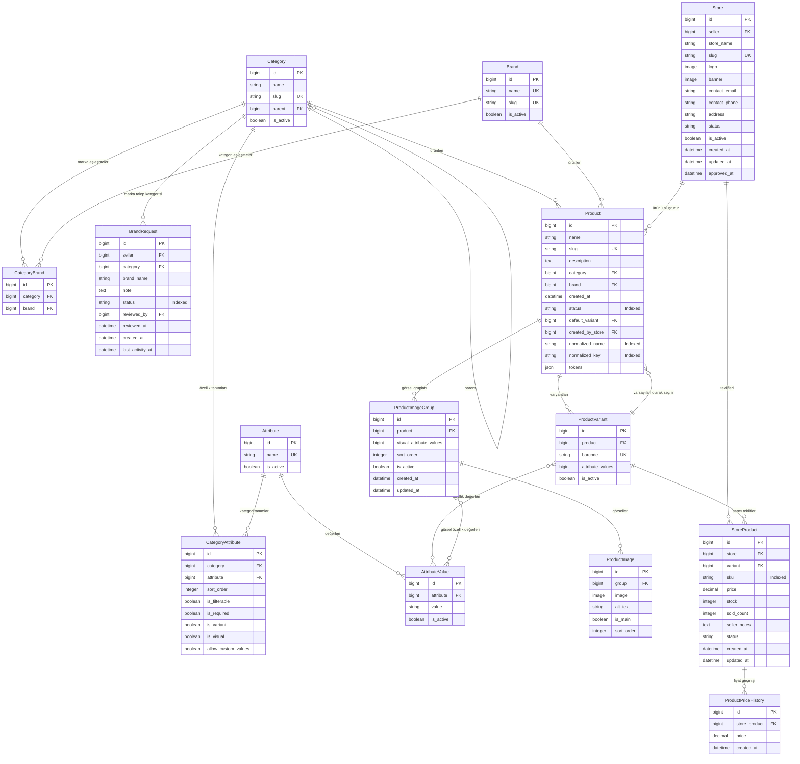

# Katalog ve Satıcı Teklifleri ER Diyagramı

Bu diyagram, mevcut Django model tanımlarındaki alanları ve ilişkileri gösterir. Model ve alan isimleri kaynak kod ile aynıdır.

```mermaid
erDiagram
    Category {
        bigint id PK
        string name
        string slug UK
        bigint parent FK
        boolean is_active
    }
    Brand {
        bigint id PK
        string name UK
        string slug UK
        boolean is_active
    }
    CategoryBrand {
        bigint id PK
        bigint category FK
        bigint brand FK
    }
    BrandRequest {
        bigint id PK
        bigint seller FK
        bigint category FK
        string brand_name
        text note
        string status "Indexed"
        bigint reviewed_by FK
        datetime reviewed_at
        datetime created_at
        datetime last_activity_at
    }
    Product {
        bigint id PK
        string name
        string slug UK
        text description
        bigint category FK
        bigint brand FK
        datetime created_at
        string status "Indexed"
        bigint default_variant FK
        bigint created_by_store FK
        string normalized_name "Indexed"
        string normalized_key "Indexed"
        json tokens
    }
    Attribute {
        bigint id PK
        string name UK
        boolean is_active
    }
    CategoryAttribute {
        bigint id PK
        bigint category FK
        bigint attribute FK
        integer sort_order
        boolean is_filterable
        boolean is_required
        boolean is_variant
        boolean is_visual
        boolean allow_custom_values
    }
    AttributeValue {
        bigint id PK
        bigint attribute FK
        string value
        boolean is_active
    }
    ProductVariant {
        bigint id PK
        bigint product FK
        string barcode UK
        bigint attribute_values
        boolean is_active
    }
    ProductImageGroup {
        bigint id PK
        bigint product FK
        bigint visual_attribute_values
        integer sort_order
        boolean is_active
        datetime created_at
        datetime updated_at
    }
    ProductImage {
        bigint id PK
        bigint group FK
        image image
        string alt_text
        boolean is_main
        integer sort_order
    }
    Store {
        bigint id PK
        bigint seller FK
        string store_name
        string slug UK
        image logo
        image banner
        string contact_email
        string contact_phone
        string address
        string status
        boolean is_active
        datetime created_at
        datetime updated_at
        datetime approved_at
    }
    StoreProduct {
        bigint id PK
        bigint store FK
        bigint variant FK
        string sku "Indexed"
        decimal price
        integer stock
        integer sold_count
        text seller_notes
        string status
        datetime created_at
        datetime updated_at
    }
    ProductPriceHistory {
        bigint id PK
        bigint store_product FK
        decimal price
        datetime created_at
    }
    Category ||--o{ Category : "parent"
    Category ||--o{ CategoryBrand : "marka eşleşmeleri"
    Brand ||--o{ CategoryBrand : "kategori eşleşmeleri"
    Category ||--o{ BrandRequest : "marka talep kategorisi"
    Category ||--o{ Product : "ürünleri"
    Brand ||--o{ Product : "ürünleri"
    ProductVariant ||--o{ Product : "varsayılan olarak seçilir"
    Store ||--o{ Product : "ürünü oluşturur"
    Category ||--o{ CategoryAttribute : "özellik tanımları"
    Attribute ||--o{ CategoryAttribute : "kategori tanımları"
    Attribute ||--o{ AttributeValue : "değerleri"
    Product ||--o{ ProductVariant : "varyantları"
    ProductVariant }o--o{ AttributeValue : "özellik değerleri"
    Product ||--o{ ProductImageGroup : "görsel grupları"
    ProductImageGroup }o--o{ AttributeValue : "görsel özellik değerleri"
    ProductImageGroup ||--o{ ProductImage : "görselleri"
    Store ||--o{ StoreProduct : "teklifleri"
    ProductVariant ||--o{ StoreProduct : "satıcı teklifleri"
    StoreProduct ||--o{ ProductPriceHistory : "fiyat geçmişi"
```
