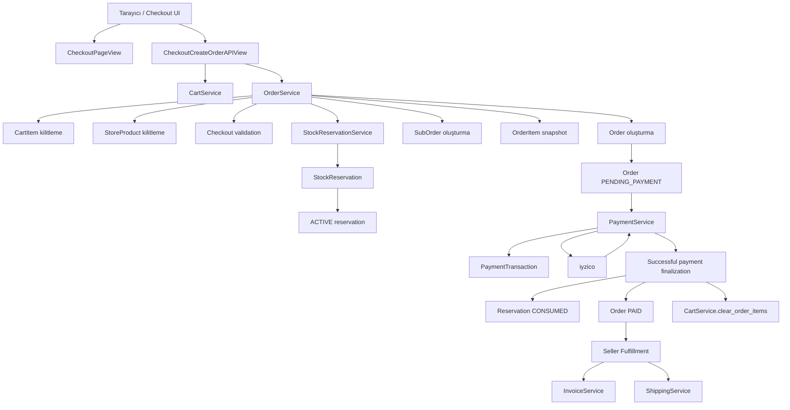

# Checkout / Order Architecture

```mermaid
graph TD
    A[Tarayıcı / Checkout UI] --> B[CheckoutPageView]
    A --> C[CheckoutCreateOrderAPIView]

    C --> D[CartService]
    C --> E[OrderService]

    E --> F[CartItem kilitleme]
    E --> G[StoreProduct kilitleme]
    E --> H[Checkout validation]
    E --> I[Order oluşturma]
    E --> J[SubOrder oluşturma]
    E --> K[OrderItem snapshot]
    E --> L[StockReservationService]

    L --> M[StockReservation]

    I --> N[Order PENDING_PAYMENT]
    M --> O[ACTIVE reservation]

    N --> P[PaymentService]
    P --> Q[PaymentTransaction]
    P --> R[iyzico]

    R --> P
    P --> S[Successful payment finalization]
    S --> T[Reservation CONSUMED]
    S --> U[Order PAID]
    S --> V[CartService.clear_order_items]

    U --> W[Seller Fulfillment]
    W --> X[InvoiceService]
    W --> Y[ShippingService]
```

> Bu diagramda payment provider'ın ayrıntıları bilinçli olarak özetlenmiştir. Ayrıntılı iyzico akışı PHASE 7'de ele alınacaktır.
