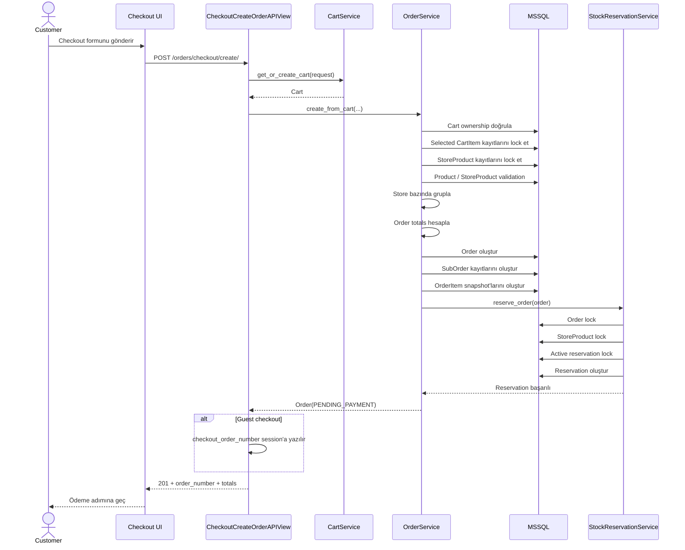

# Checkout Create Sequence

```mermaid
sequenceDiagram
    actor Customer
    participant UI as Checkout UI
    participant View as CheckoutCreateOrderAPIView
    participant Cart as CartService
    participant Order as OrderService
    participant DB as MSSQL
    participant Stock as StockReservationService

    Customer->>UI: Checkout formunu gönderir
    UI->>View: POST /orders/checkout/create/
    View->>Cart: get_or_create_cart(request)
    Cart-->>View: Cart

    View->>Order: create_from_cart(...)

    Order->>DB: Cart ownership doğrula
    Order->>DB: Selected CartItem kayıtlarını lock et
    Order->>DB: StoreProduct kayıtlarını lock et
    Order->>DB: Product / StoreProduct validation
    Order->>Order: Store bazında grupla
    Order->>Order: Order totals hesapla

    Order->>DB: Order oluştur
    Order->>DB: SubOrder kayıtlarını oluştur
    Order->>DB: OrderItem snapshot'larını oluştur

    Order->>Stock: reserve_order(order)
    Stock->>DB: Order lock
    Stock->>DB: StoreProduct lock
    Stock->>DB: Active reservation lock
    Stock->>DB: Reservation oluştur
    Stock-->>Order: Reservation başarılı

    Order-->>View: Order(PENDING_PAYMENT)

    alt Guest checkout
        View->>View: checkout_order_number session'a yazılır
    end

    View-->>UI: 201 + order_number + totals
    UI-->>Customer: Ödeme adımına geç
```
