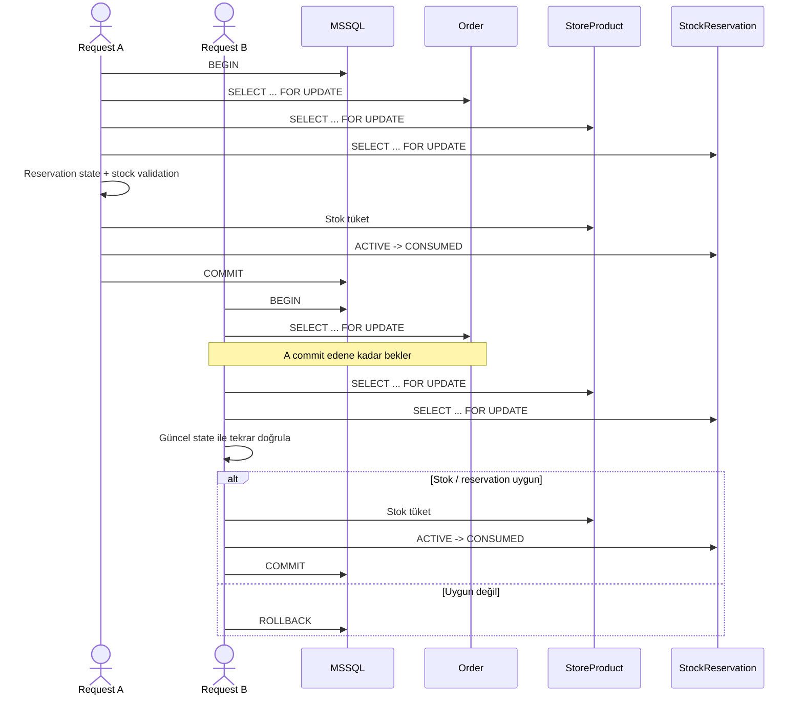

# Stock Reservation Concurrency



## Amaç

İki paralel request'in aynı eski stock değerini okuyup aynı ürünü satmasını engellemek.

## Lock sırası

```text
Order
 ↓
StoreProduct
 ↓
StockReservation
```

Aynı resource set'ine dokunan operasyonlarda bu sıranın korunması deadlock riskini azaltır.
