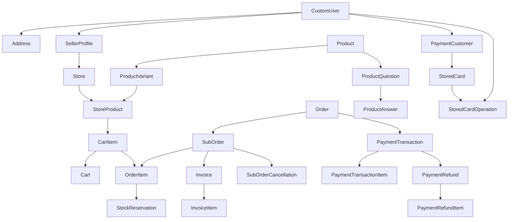

# Genel Veritabanı ER Diyagramı

Bu, 44 modelin tamamını tek kutuya doldurmak yerine domainler arasındaki ana veri akışını gösteren özet diyagramdır. Ayrıntılı alanlar domain bazlı diyagramlarda bulunur.

## Ayrıntılı Diyagramlar

- [Kimlik ve Mağaza](identity-store-er.md)
- [Katalog ve Satıcı Teklifleri](catalog-core-er.md)
- [Ürün Taslağı, Koleksiyon ve Soru-Cevap](product-engagement-er.md)
- [Sepet](cart-er.md)
- [Sipariş ve Fatura](order-er.md)
- [Ödeme ve Refund](payment-er.md)
