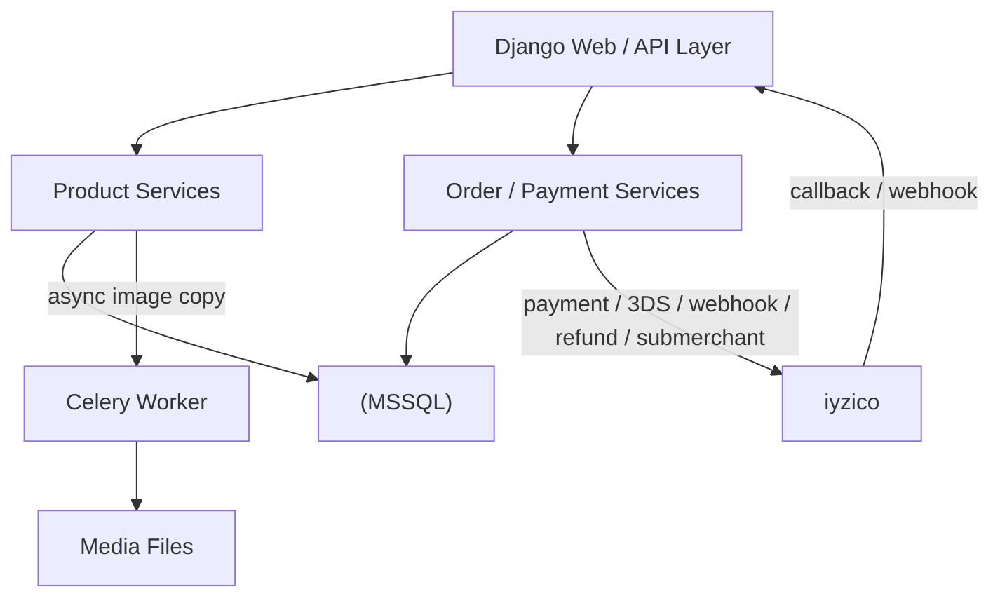

# Dış Servis ve Asenkron İşlem Diyagramı

## Entegrasyonlar

### iyzico

Ödeme, 3DS callback, webhook, kayıtlı kart, refund ve seller sub-merchant işlemleri için kullanılır.

### Celery

Ürün yayınlama sonrasındaki ağır görsel kopyalama işlemini request akışından ayırmak için kullanılır.

### MSSQL

Uygulamanın kalıcı transactional verisinin ana kaynağıdır.
