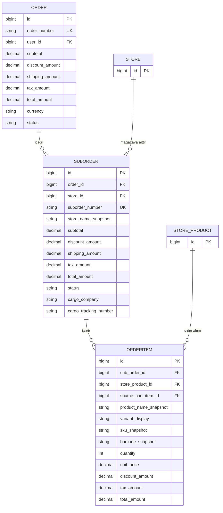

# Multi-Vendor Order Split



Örnek business sonucu:

```text
Tek checkout
    ↓
Tek Order
    ├── Store A → SubOrder A → OrderItem'lar
    └── Store B → SubOrder B → OrderItem'lar
```

Aynı `Order` içinde aynı `Store` için yalnızca bir `SubOrder` bulunmasına model seviyesinde `UniqueConstraint(order, store)` ile izin verilir.
