# Sipariş ve Fatura ER Diyagramı

Bu diyagram, mevcut Django model tanımlarındaki alanları ve ilişkileri gösterir. Model ve alan isimleri kaynak kod ile aynıdır.

```mermaid
erDiagram
    Order {
        bigint id PK
        string order_number UK
        bigint user FK
        string buyer_identity_number
        string customer_email
        string customer_phone
        decimal subtotal
        decimal discount_amount
        decimal shipping_amount
        decimal tax_amount
        decimal total_amount
        string currency
        string discount_code_snapshot
        string status "Indexed"
        string shipping_full_name
        string shipping_phone
        string shipping_address_line1
        string shipping_address_line2
        string shipping_city
        string shipping_state
        string shipping_postal_code
        string billing_full_name
        string billing_phone
        string billing_address_line1
        string billing_address_line2
        string billing_city
        string billing_state
        string billing_postal_code
        datetime created_at
        datetime updated_at
        datetime paid_at
        datetime completed_at
        datetime cancelled_at
    }
    SubOrder {
        bigint id PK
        bigint order FK
        bigint store FK
        string suborder_number UK
        string store_name_snapshot
        decimal subtotal
        decimal discount_amount
        decimal shipping_amount
        decimal tax_amount
        decimal total_amount
        string status "Indexed"
        string cargo_company
        string cargo_tracking_number "Indexed"
        datetime shipped_at
        datetime delivered_at
        datetime cancelled_at
        datetime created_at
        datetime updated_at
    }
    OrderItem {
        bigint id PK
        bigint sub_order FK
        bigint store_product FK
        bigint source_cart_item FK
        datetime source_cart_item_updated_at
        image image_snapshot
        string product_name_snapshot
        json variant_snapshot
        string variant_display
        string sku_snapshot
        string barcode_snapshot
        integer quantity
        decimal unit_price
        decimal discount_amount
        decimal tax_amount
        decimal total_amount
        datetime created_at
    }
    StockReservation {
        bigint id PK
        bigint order_item FK
        integer quantity
        string status "Indexed"
        datetime expires_at "Indexed"
        datetime created_at
        datetime updated_at
    }
    Invoice {
        bigint id PK
        bigint suborder FK
        string invoice_number UK
        datetime issued_at
        string seller_display_name
        string seller_legal_company_title
        text seller_address
        string seller_phone
        string seller_tax_office
        string seller_tax_number
        string seller_identity_number
        string buyer_full_name
        string buyer_phone
        string buyer_email
        string buyer_identity_number
        string buyer_billing_address_line1
        string buyer_billing_address_line2
        string buyer_billing_city
        string buyer_billing_state
        string buyer_billing_postal_code
        decimal subtotal
        decimal discount_amount
        decimal shipping_amount
        decimal tax_amount
        decimal total_amount
        string currency
        datetime created_at
        datetime updated_at
    }
    InvoiceItem {
        bigint id PK
        bigint invoice FK
        string product_name
        string variant_display
        string sku
        string barcode
        integer quantity
        decimal unit_price
        decimal discount_amount
        decimal tax_amount
        decimal total_amount
        datetime created_at
    }
    Store {
        bigint id PK
        bigint seller FK
        string store_name
        string slug UK
        image logo
        image banner
        string contact_email
        string contact_phone
        string address
        string status
        boolean is_active
        datetime created_at
        datetime updated_at
        datetime approved_at
    }
    StoreProduct {
        bigint id PK
        bigint store FK
        bigint variant FK
        string sku "Indexed"
        decimal price
        integer stock
        integer sold_count
        text seller_notes
        string status
        datetime created_at
        datetime updated_at
    }
    CartItem {
        bigint id PK
        bigint cart FK
        bigint store_product FK
        integer quantity
        boolean is_selected
        decimal last_seen_price
        datetime added_at
        datetime updated_at
    }
    CustomUser {
        bigint id PK
        string password
        datetime last_login
        boolean is_superuser
        string first_name
        string last_name
        boolean is_staff
        boolean is_active
        datetime date_joined
        string email UK
        string phone_number UK
        boolean is_seller
    }
    CustomUser ||--o{ Order : "siparişleri"
    Order ||--o{ SubOrder : "alt siparişleri"
    Store ||--o{ SubOrder : "mağaza siparişleri"
    SubOrder ||--o{ OrderItem : "sipariş kalemleri"
    StoreProduct ||--o{ OrderItem : "satın alınan teklif"
    CartItem ||--o{ OrderItem : "kaynak kayıt"
    OrderItem ||--o{ StockReservation : "stok rezervasyonları"
    SubOrder ||--|| Invoice : "alt sipariş"
    Invoice ||--o{ InvoiceItem : "fatura kalemleri"
    Store ||--o{ StoreProduct : "mağazaya ait"
    StoreProduct ||--o{ CartItem : "mağaza teklifi"
```

> Not: `OrderItem` hem canlı `StoreProduct` referansını hem de sipariş anındaki kritik bilgilerin snapshot alanlarını taşır. `StoreProduct` daha sonra değişse bile sipariş geçmişi `OrderItem` üzerindeki snapshot değerleriyle korunur.

> Not: `SubOrder` bir mağazaya ait alt sipariştir. Aynı `Order` altında aynı `Store` için ikinci bir `SubOrder` oluşmasını `unique_store_per_order` engeller.
