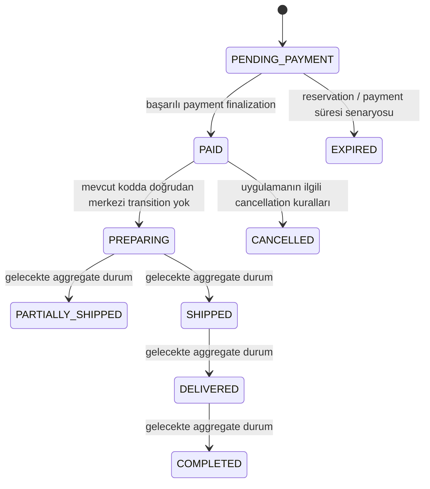
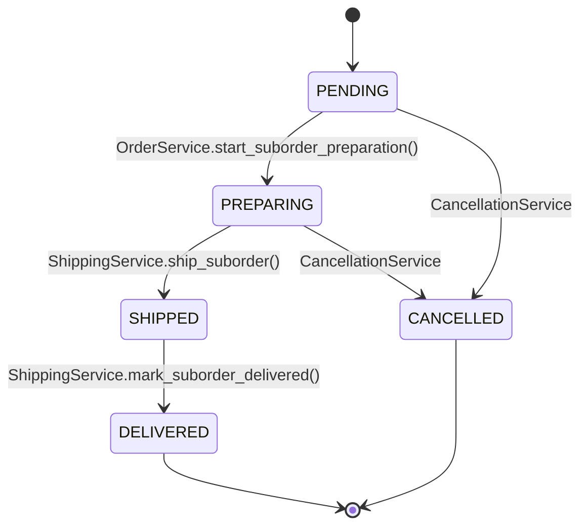

# Order ve SubOrder Yaşam Döngüsü

## Ana Order

> Ana `OrderStatus` enum'unda bu değerlerin tamamı bulunur; ancak mevcut kodun merkezi bir Order aggregate/status transition motoru tüm sonraki geçişleri otomatik olarak uygulamamaktadır. Diyagramdaki bazı geçişler bu nedenle mevcut state vocabulary'sini gösteren dokümantasyon niteliğindedir.

## SubOrder

