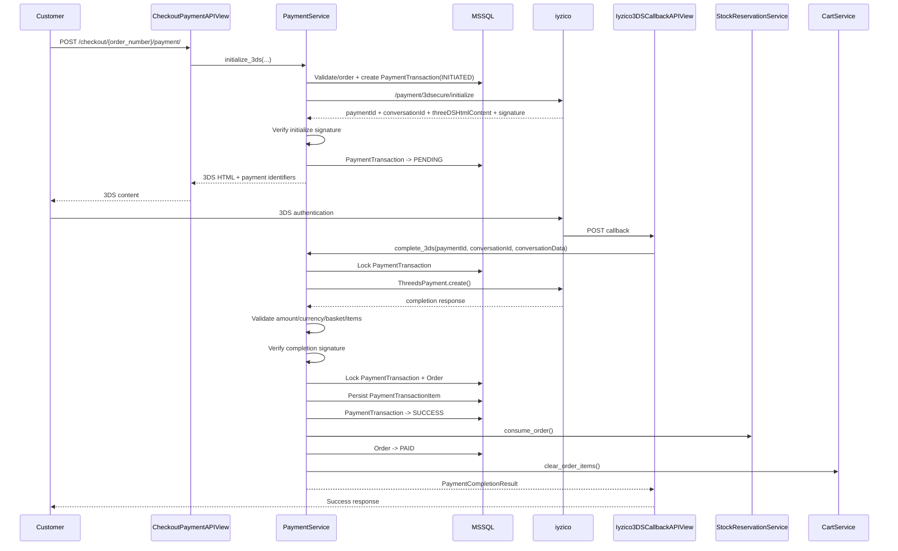

# 3DS Payment Sequence

```mermaid
sequenceDiagram
    participant C as Customer
    participant V as CheckoutPaymentAPIView
    participant P as PaymentService
    participant DB as MSSQL
    participant I as iyzico
    participant CB as Iyzico3DSCallbackAPIView
    participant SR as StockReservationService
    participant CS as CartService

    C->>V: POST /checkout/{order_number}/payment/
    V->>P: initialize_3ds(...)
    P->>DB: Validate/order + create PaymentTransaction(INITIATED)
    P->>I: /payment/3dsecure/initialize
    I-->>P: paymentId + conversationId + threeDSHtmlContent + signature
    P->>P: Verify initialize signature
    P->>DB: PaymentTransaction -> PENDING
    P-->>V: 3DS HTML + payment identifiers
    V-->>C: 3DS content

    C->>I: 3DS authentication
    I->>CB: POST callback
    CB->>P: complete_3ds(paymentId, conversationId, conversationData)
    P->>DB: Lock PaymentTransaction
    P->>I: ThreedsPayment.create()
    I-->>P: completion response
    P->>P: Validate amount/currency/basket/items
    P->>P: Verify completion signature
    P->>DB: Lock PaymentTransaction + Order
    P->>DB: Persist PaymentTransactionItem
    P->>DB: PaymentTransaction -> SUCCESS
    P->>SR: consume_order()
    P->>DB: Order -> PAID
    P->>CS: clear_order_items()
    P-->>CB: PaymentCompletionResult
    CB-->>C: Success response
```
