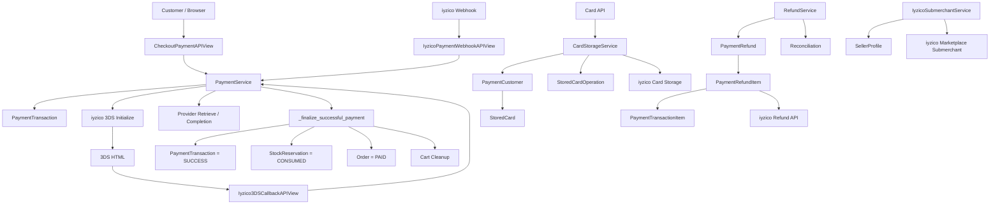

# Payment Architecture Diagram

```mermaid
graph TD
    A[Customer / Browser] --> B[CheckoutPaymentAPIView]
    B --> C[PaymentService]

    C --> D[PaymentTransaction]
    C --> E[iyzico 3DS Initialize]

    E --> F[3DS HTML]
    F --> G[Iyzico3DSCallbackAPIView]
    G --> C

    H[iyzico Webhook] --> I[IyzicoPaymentWebhookAPIView]
    I --> C

    C --> J[Provider Retrieve / Completion]
    C --> K[_finalize_successful_payment]

    K --> L["PaymentTransaction = SUCCESS"]
    K --> M["StockReservation = CONSUMED"]
    K --> N["Order = PAID"]
    K --> O[Cart Cleanup]

    P[Card API] --> Q[CardStorageService]
    Q --> R[PaymentCustomer]
    R --> S[StoredCard]
    Q --> T[StoredCardOperation]
    Q --> U[iyzico Card Storage]

    V[RefundService] --> W[PaymentRefund]
    W --> X[PaymentRefundItem]
    X --> Y[PaymentTransactionItem]
    X --> Z[iyzico Refund API]
    V --> AA[Reconciliation]

    AB[IyzicoSubmerchantService] --> AC[SellerProfile]
    AB --> AD[iyzico Marketplace Submerchant]
```
