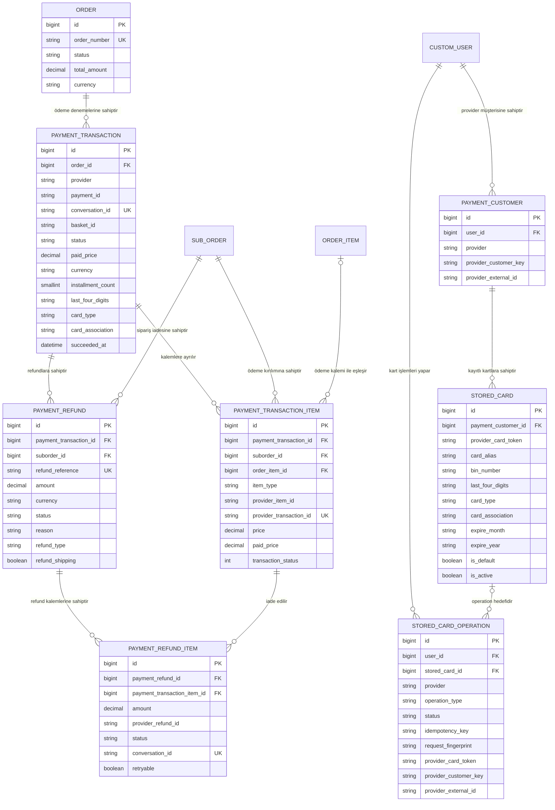

# Payment Data Model Diagram

```mermaid
erDiagram
    ORDER ||--o{ PAYMENT_TRANSACTION : "ödeme denemelerine sahiptir"

    PAYMENT_TRANSACTION ||--o{ PAYMENT_TRANSACTION_ITEM : "kalemlere ayrılır"
    SUB_ORDER ||--o{ PAYMENT_TRANSACTION_ITEM : "ödeme kırılımına sahiptir"
    ORDER_ITEM o|--o{ PAYMENT_TRANSACTION_ITEM : "ödeme kalemi ile eşleşir"

    CUSTOM_USER ||--o{ PAYMENT_CUSTOMER : "provider müşterisine sahiptir"
    PAYMENT_CUSTOMER ||--o{ STORED_CARD : "kayıtlı kartlara sahiptir"
    CUSTOM_USER ||--o{ STORED_CARD_OPERATION : "kart işlemleri yapar"
    STORED_CARD o|--o{ STORED_CARD_OPERATION : "operation hedefidir"

    PAYMENT_TRANSACTION ||--o{ PAYMENT_REFUND : "refundlara sahiptir"
    SUB_ORDER ||--o{ PAYMENT_REFUND : "alt sipariş iadesine sahiptir"
    PAYMENT_REFUND ||--o{ PAYMENT_REFUND_ITEM : "refund kalemlerine sahiptir"
    PAYMENT_TRANSACTION_ITEM ||--o{ PAYMENT_REFUND_ITEM : "iade edilir"

    ORDER {
        bigint id PK
        string order_number UK
        string status
        decimal total_amount
        string currency
    }

    PAYMENT_TRANSACTION {
        bigint id PK
        bigint order_id FK
        string provider
        string payment_id
        string conversation_id UK
        string basket_id
        string status
        decimal paid_price
        string currency
        smallint installment_count
        string last_four_digits
        string card_type
        string card_association
        datetime succeeded_at
    }

    PAYMENT_TRANSACTION_ITEM {
        bigint id PK
        bigint payment_transaction_id FK
        bigint suborder_id FK
        bigint order_item_id FK
        string item_type
        string provider_item_id
        string provider_transaction_id UK
        decimal price
        decimal paid_price
        int transaction_status
    }

    PAYMENT_CUSTOMER {
        bigint id PK
        bigint user_id FK
        string provider
        string provider_customer_key
        string provider_external_id
    }

    STORED_CARD {
        bigint id PK
        bigint payment_customer_id FK
        string provider_card_token
        string card_alias
        string bin_number
        string last_four_digits
        string card_type
        string card_association
        string expire_month
        string expire_year
        boolean is_default
        boolean is_active
    }

    STORED_CARD_OPERATION {
        bigint id PK
        bigint user_id FK
        bigint stored_card_id FK
        string provider
        string operation_type
        string status
        string idempotency_key
        string request_fingerprint
        string provider_card_token
        string provider_customer_key
        string provider_external_id
    }

    PAYMENT_REFUND {
        bigint id PK
        bigint payment_transaction_id FK
        bigint suborder_id FK
        string refund_reference UK
        decimal amount
        string currency
        string status
        string reason
        string refund_type
        boolean refund_shipping
    }

    PAYMENT_REFUND_ITEM {
        bigint id PK
        bigint payment_refund_id FK
        bigint payment_transaction_item_id FK
        decimal amount
        string provider_refund_id
        string status
        string conversation_id UK
        boolean retryable
    }
```
