# Ödeme, Kayıtlı Kart ve Refund ER Diyagramı

Bu diyagram, mevcut Django model tanımlarındaki alanları ve ilişkileri gösterir. Model ve alan isimleri kaynak kod ile aynıdır.

```mermaid
erDiagram
    Order {
        bigint id PK
        string order_number UK
        bigint user FK
        string buyer_identity_number
        string customer_email
        string customer_phone
        decimal subtotal
        decimal discount_amount
        decimal shipping_amount
        decimal tax_amount
        decimal total_amount
        string currency
        string discount_code_snapshot
        string status "Indexed"
        string shipping_full_name
        string shipping_phone
        string shipping_address_line1
        string shipping_address_line2
        string shipping_city
        string shipping_state
        string shipping_postal_code
        string billing_full_name
        string billing_phone
        string billing_address_line1
        string billing_address_line2
        string billing_city
        string billing_state
        string billing_postal_code
        datetime created_at
        datetime updated_at
        datetime paid_at
        datetime completed_at
        datetime cancelled_at
    }
    SubOrder {
        bigint id PK
        bigint order FK
        bigint store FK
        string suborder_number UK
        string store_name_snapshot
        decimal subtotal
        decimal discount_amount
        decimal shipping_amount
        decimal tax_amount
        decimal total_amount
        string status "Indexed"
        string cargo_company
        string cargo_tracking_number "Indexed"
        datetime shipped_at
        datetime delivered_at
        datetime cancelled_at
        datetime created_at
        datetime updated_at
    }
    OrderItem {
        bigint id PK
        bigint sub_order FK
        bigint store_product FK
        bigint source_cart_item FK
        datetime source_cart_item_updated_at
        image image_snapshot
        string product_name_snapshot
        json variant_snapshot
        string variant_display
        string sku_snapshot
        string barcode_snapshot
        integer quantity
        decimal unit_price
        decimal discount_amount
        decimal tax_amount
        decimal total_amount
        datetime created_at
    }
    PaymentTransaction {
        bigint id PK
        bigint order FK
        string provider "Indexed"
        string payment_id
        string conversation_id
        string basket_id
        string status "Indexed"
        integer fraud_status
        decimal paid_price
        string currency
        smallint installment_count
        string last_four_digits
        string card_type
        string card_association
        datetime created_at
        datetime updated_at
        datetime succeeded_at
    }
    PaymentTransactionItem {
        bigint id PK
        bigint payment_transaction FK
        bigint suborder FK
        bigint order_item FK
        string item_type
        string provider_item_id
        string provider_transaction_id
        decimal price
        decimal paid_price
        integer transaction_status
        datetime created_at
        datetime updated_at
    }
    PaymentCustomer {
        bigint id PK
        bigint user FK
        string provider "Indexed"
        string provider_customer_key
        string provider_external_id
        datetime created_at
        datetime updated_at
    }
    StoredCard {
        bigint id PK
        bigint payment_customer FK
        string provider_card_token
        string card_alias
        string bin_number
        string last_four_digits
        string card_type
        string card_association
        string card_family
        integer card_bank_code
        string card_bank_name
        string expire_month
        string expire_year
        boolean is_default
        boolean is_active "Indexed"
        datetime created_at
        datetime updated_at
    }
    StoredCardOperation {
        bigint id PK
        bigint user FK
        string provider
        string operation_type
        string status
        string idempotency_key
        string request_fingerprint
        bigint stored_card FK
        boolean make_default
        string provider_card_token
        string provider_customer_key
        string provider_external_id
        string error_code
        string error_message
        datetime completed_at
        datetime created_at
        datetime updated_at
    }
    PaymentRefund {
        bigint id PK
        bigint payment_transaction FK
        bigint suborder FK
        string refund_reference UK
        decimal amount
        string currency
        string status "Indexed"
        string reason
        string refund_type
        boolean refund_shipping
        datetime created_at
        datetime updated_at
        datetime completed_at
    }
    PaymentRefundItem {
        bigint id PK
        bigint payment_refund FK
        bigint payment_transaction_item FK
        decimal amount
        string provider_refund_id "Indexed"
        string status "Indexed"
        string conversation_id UK
        boolean retryable
        string provider_error_code
        string provider_error_message
        datetime created_at
        datetime updated_at
        datetime completed_at
    }
    SubOrderCancellation {
        bigint id PK
        bigint suborder FK
        bigint cancelled_by FK
        string reason
        decimal refund_amount
        bigint payment_refund FK
        datetime cancelled_at
        datetime created_at
    }
    CustomUser {
        bigint id PK
        string password
        datetime last_login
        boolean is_superuser
        string first_name
        string last_name
        boolean is_staff
        boolean is_active
        datetime date_joined
        string email UK
        string phone_number UK
        boolean is_seller
    }
    CustomUser ||--o{ Order : "kullanıcı ilişkisi"
    Order ||--o{ SubOrder : "ana sipariş"
    SubOrder ||--o{ OrderItem : "mağaza siparişi"
    Order ||--o{ PaymentTransaction : "ödeme denemeleri"
    PaymentTransaction ||--o{ PaymentTransactionItem : "ödeme kalemleri"
    SubOrder ||--o{ PaymentTransactionItem : "alt sipariş eşleşmeleri"
    OrderItem ||--o{ PaymentTransactionItem : "ödeme eşleşmeleri"
    CustomUser ||--o{ PaymentCustomer : "ödeme profilleri"
    PaymentCustomer ||--o{ StoredCard : "ödeme müşterisine ait"
    CustomUser ||--o{ StoredCardOperation : "kart işlemleri"
    StoredCard ||--o{ StoredCardOperation : "işlemleri"
    PaymentTransaction ||--o{ PaymentRefund : "iadeleri"
    SubOrder ||--o{ PaymentRefund : "iade kayıtları"
    PaymentRefund ||--o{ PaymentRefundItem : "iade kalemleri"
    PaymentTransactionItem ||--o{ PaymentRefundItem : "iade eşleşmeleri"
    SubOrder ||--|| SubOrderCancellation : "alt sipariş"
    CustomUser ||--o{ SubOrderCancellation : "iptal işlemleri"
    PaymentRefund ||--|| SubOrderCancellation : "iptale bağlı iade"
```

> Not: `PaymentTransaction` bir ödeme denemesini temsil eder; aynı `Order` altında birden fazla deneme olabilir. `PaymentTransactionItem` provider seviyesindeki ürün/kargo ayrımını ve refund için gerekli yerel eşleşmeleri saklar.

> Not: `StoredCard` üzerinde PAN/CVC tutulmaz; provider token ve kart metadata'sı tutulur. `StoredCardOperation` create/delete işlemlerinde idempotency ve reconciliation durumlarını yönetmek için kullanılır.
