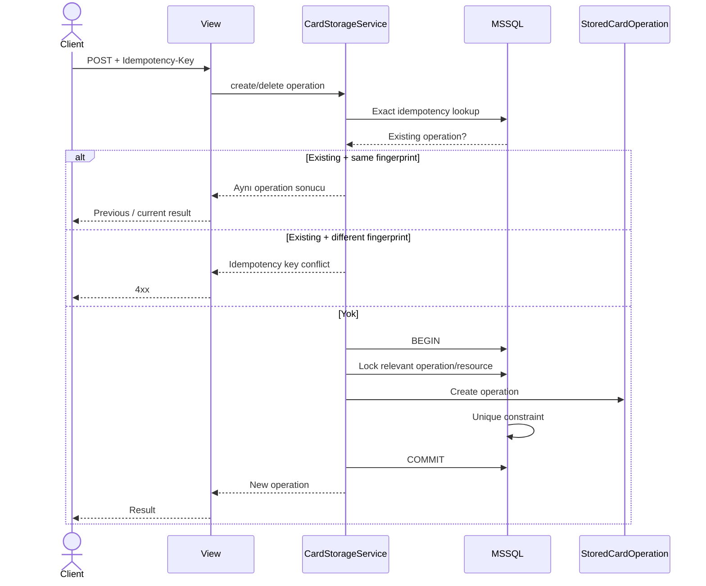

# Payment / Stored Card Idempotency

```mermaid
sequenceDiagram
    actor C as Client
    participant V as View
    participant S as CardStorageService
    participant DB as MSSQL
    participant OP as StoredCardOperation

    C->>V: POST + Idempotency-Key
    V->>S: create/delete operation

    S->>DB: Exact idempotency lookup
    DB-->>S: Existing operation?

    alt Existing + same fingerprint
        S-->>V: Aynı operation sonucu
        V-->>C: Previous / current result
    else Existing + different fingerprint
        S-->>V: Idempotency key conflict
        V-->>C: 4xx
    else Yok
        S->>DB: BEGIN
        S->>DB: Lock relevant operation/resource
        S->>OP: Create operation
        DB->>DB: Unique constraint
        S->>DB: COMMIT
        S-->>V: New operation
        V-->>C: Result
    end
```

İdempotency anahtarı tek başına yeterli değildir; aynı key ile gönderilen payload'ın da aynı işlemi temsil ettiği doğrulanmalıdır.
