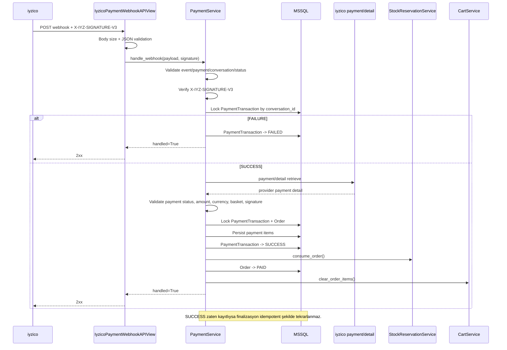

# iyzico Webhook Sequence

```mermaid
sequenceDiagram
    participant I as iyzico
    participant V as IyzicoPaymentWebhookAPIView
    participant P as PaymentService
    participant DB as MSSQL
    participant R as iyzico payment/detail
    participant SR as StockReservationService
    participant CS as CartService

    I->>V: POST webhook + X-IYZ-SIGNATURE-V3
    V->>V: Body size + JSON validation
    V->>P: handle_webhook(payload, signature)
    P->>P: Validate event/payment/conversation/status
    P->>P: Verify X-IYZ-SIGNATURE-V3
    P->>DB: Lock PaymentTransaction by conversation_id

    alt FAILURE
        P->>DB: PaymentTransaction -> FAILED
        P-->>V: handled=True
        V-->>I: 2xx
    else SUCCESS
        P->>R: payment/detail retrieve
        R-->>P: provider payment detail
        P->>P: Validate payment status, amount, currency, basket, signature
        P->>DB: Lock PaymentTransaction + Order
        P->>DB: Persist payment items
        P->>DB: PaymentTransaction -> SUCCESS
        P->>SR: consume_order()
        P->>DB: Order -> PAID
        P->>CS: clear_order_items()
        P-->>V: handled=True
        V-->>I: 2xx
    end

    Note over P,DB: SUCCESS zaten kayıtlıysa finalizasyon idempotent şekilde tekrarlanmaz.
```
