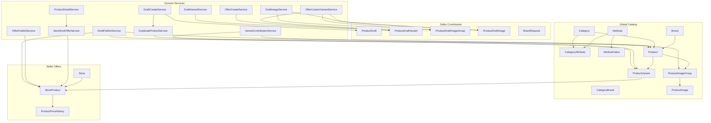

# Product Domain Component Diagramı

```mermaid
graph TB
    subgraph Catalog[Global Catalog]
        CATEGORY[Category]
        BRAND[Brand]
        CATEGORY_BRAND[CategoryBrand]
        ATTRIBUTE[Attribute]
        CATEGORY_ATTRIBUTE[CategoryAttribute]
        ATTRIBUTE_VALUE[AttributeValue]
        PRODUCT[Product]
        VARIANT[ProductVariant]
        IMAGE_GROUP[ProductImageGroup]
        IMAGE[ProductImage]
    end

    subgraph Seller[Seller Contribution]
        DRAFT[ProductDraft]
        DRAFT_VARIANT[ProductDraftVariant]
        DRAFT_IMAGE_GROUP[ProductDraftImageGroup]
        DRAFT_IMAGE[ProductDraftImage]
        BRAND_REQUEST[BrandRequest]
    end

    subgraph Offers[Seller Offers]
        STORE[Store]
        STORE_PRODUCT[StoreProduct]
        PRICE_HISTORY[ProductPriceHistory]
    end

    subgraph Services[Domain Services]
        DRAFT_CREATE[DraftCreateService]
        DUPLICATE[DuplicateProductService]
        DRAFT_VARIANT_SVC[DraftVariantService]
        DRAFT_IMAGE_SVC[DraftImageService]
        OFFER_CREATE[OfferCreateService]
        CUSTOM_VARIANT[OfferCustomVariantService]
        CONTRIBUTION[VariantContributionService]
        PUBLISH[DraftPublishService]
        OFFER_PUBLISH[OfferPublishService]
        DETAIL[ProductDetailService]
        STOREFRONT[StorefrontOfferService]
    end

    DRAFT_CREATE --> DRAFT
    DRAFT_CREATE --> DUPLICATE
    DUPLICATE --> PRODUCT
    DRAFT_VARIANT_SVC --> DRAFT_VARIANT
    DRAFT_IMAGE_SVC --> DRAFT_IMAGE_GROUP
    DRAFT_IMAGE_SVC --> DRAFT_IMAGE
    OFFER_CREATE --> DRAFT_VARIANT
    CUSTOM_VARIANT --> DRAFT_VARIANT
    CUSTOM_VARIANT --> DRAFT_IMAGE_GROUP
    CUSTOM_VARIANT --> DRAFT_IMAGE
    CONTRIBUTION --> VARIANT
    CONTRIBUTION --> IMAGE_GROUP
    PUBLISH --> PRODUCT
    PUBLISH --> VARIANT
    PUBLISH --> STORE_PRODUCT
    OFFER_PUBLISH --> STORE_PRODUCT
    DETAIL --> STOREFRONT
    STOREFRONT --> STORE_PRODUCT

    CATEGORY --> PRODUCT
    BRAND --> PRODUCT
    CATEGORY --> CATEGORY_ATTRIBUTE
    ATTRIBUTE --> CATEGORY_ATTRIBUTE
    ATTRIBUTE --> ATTRIBUTE_VALUE
    PRODUCT --> VARIANT
    PRODUCT --> IMAGE_GROUP
    IMAGE_GROUP --> IMAGE
    VARIANT --> STORE_PRODUCT
    STORE --> STORE_PRODUCT
    STORE_PRODUCT --> PRICE_HISTORY
```

