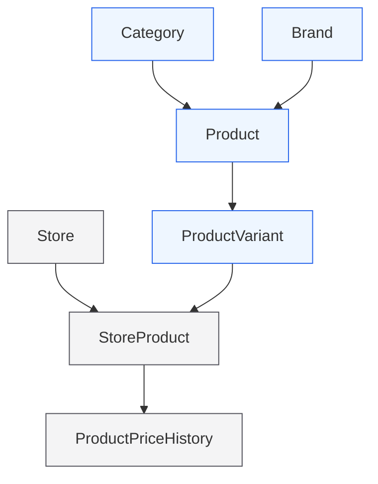
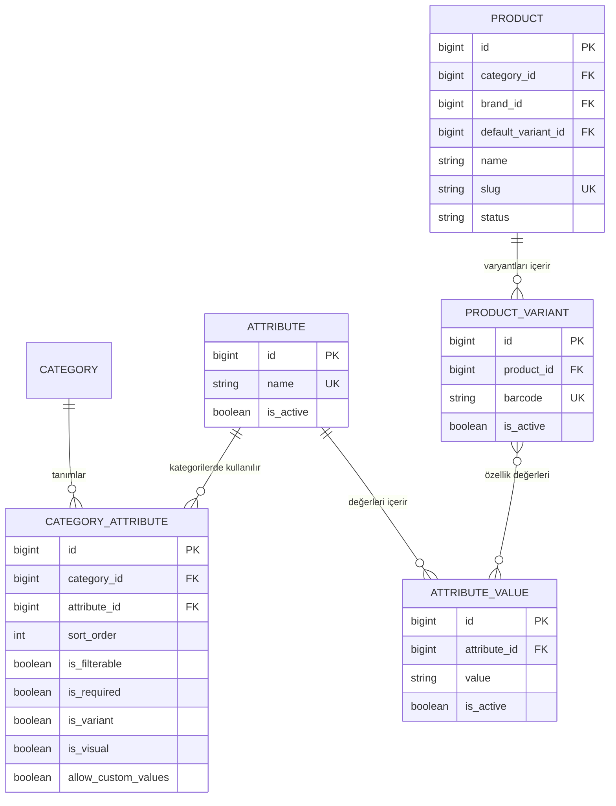
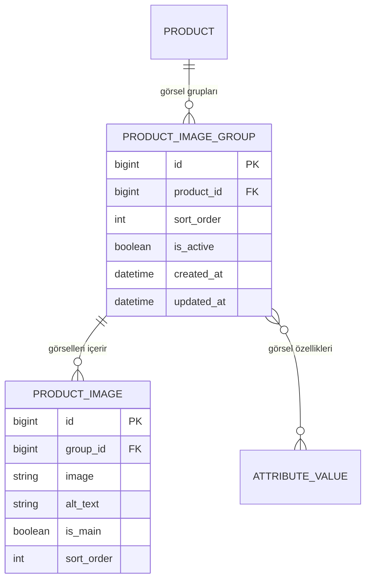
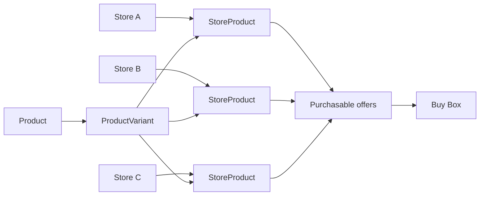
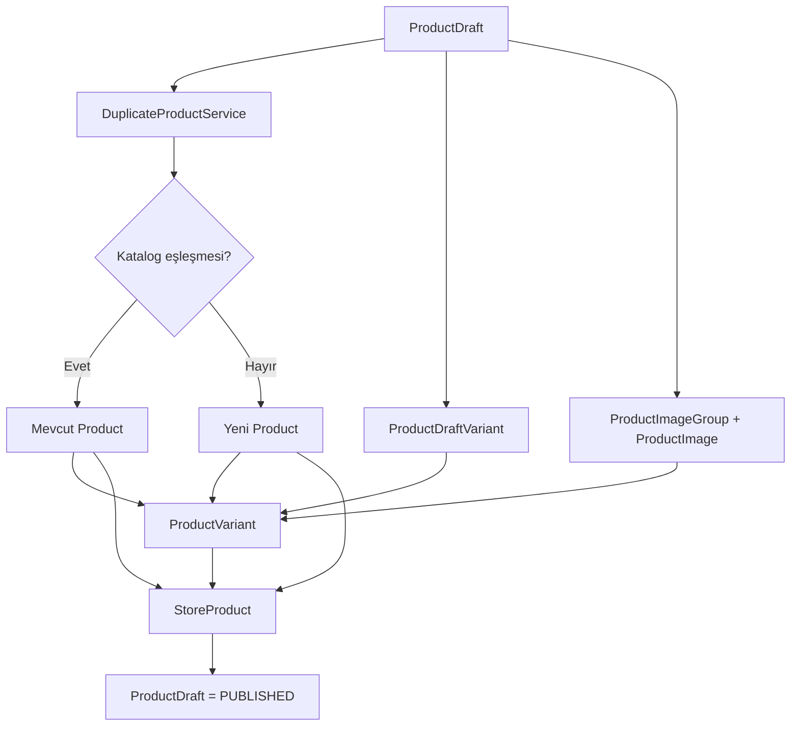
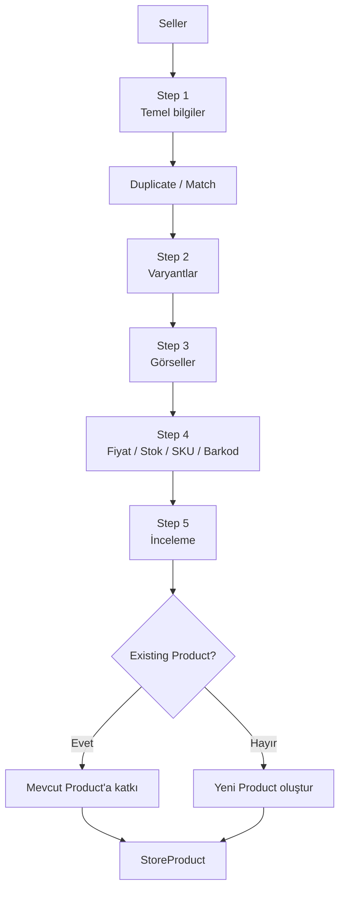

# Product / Multi-Vendor Architecture Diyagramları

## 1. Global Catalog ve Seller Offer

> GitHub'daki normal Markdown görünümünde Mermaid kodu kutular ve bağlantılar şeklinde render edilir.

---

## 2. Variant / Attribute EAV

---

## 3. Ürün Görselleri

---

## 4. Seller Offer ve Buy Box

---

## 5. Product Draft → Catalog

---

## 6. Product Wizard

