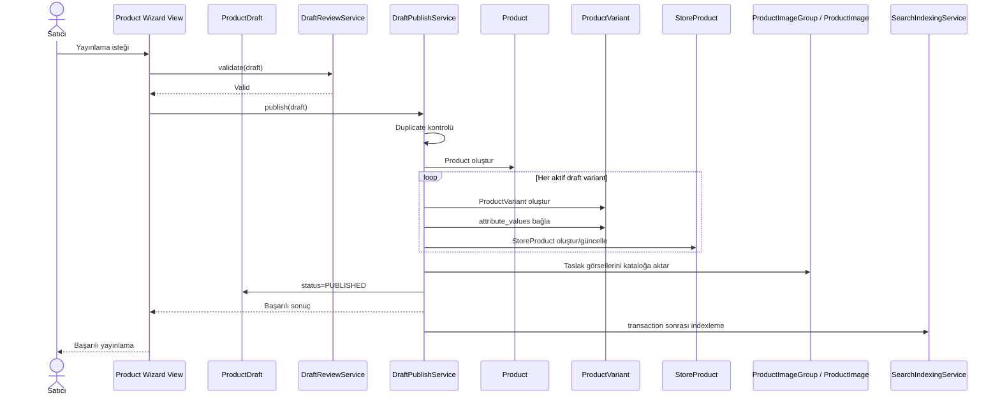
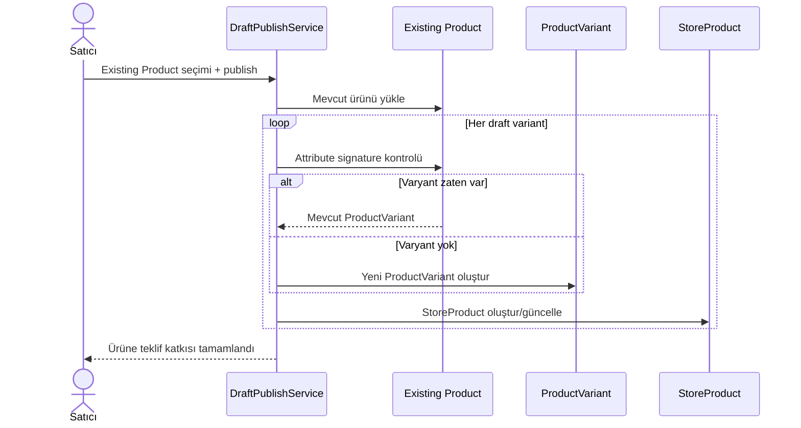

# Ürün Yayınlama Sequence Diagramları

## Yeni Ürün Yayınlama

```mermaid
sequenceDiagram
    actor Seller as Satıcı
    participant View as Product Wizard View
    participant Draft as ProductDraft
    participant Review as DraftReviewService
    participant Publish as DraftPublishService
    participant Product as Product
    participant Variant as ProductVariant
    participant Offer as StoreProduct
    participant Image as ProductImageGroup / ProductImage
    participant Index as SearchIndexingService

    Seller->>View: Yayınlama isteği
    View->>Review: validate(draft)
    Review-->>View: Valid
    View->>Publish: publish(draft)
    Publish->>Publish: Duplicate kontrolü
    Publish->>Product: Product oluştur
    loop Her aktif draft variant
        Publish->>Variant: ProductVariant oluştur
        Publish->>Variant: attribute_values bağla
        Publish->>Offer: StoreProduct oluştur/güncelle
    end
    Publish->>Image: Taslak görsellerini kataloğa aktar
    Publish->>Draft: status=PUBLISHED
    Publish-->>View: Başarılı sonuç
    Publish->>Index: transaction sonrası indexleme
    View-->>Seller: Başarılı yayınlama
```

---

## Mevcut Ürüne Katkı

```mermaid
sequenceDiagram
    actor Seller as Satıcı
    participant Publish as DraftPublishService
    participant Product as Existing Product
    participant Variant as ProductVariant
    participant Offer as StoreProduct

    Seller->>Publish: Existing Product seçimi + publish
    Publish->>Product: Mevcut ürünü yükle

    loop Her draft variant
        Publish->>Product: Attribute signature kontrolü
        alt Varyant zaten var
            Product-->>Publish: Mevcut ProductVariant
        else Varyant yok
            Publish->>Variant: Yeni ProductVariant oluştur
        end
        Publish->>Offer: StoreProduct oluştur/güncelle
    end

    Publish-->>Seller: Ürüne teklif katkısı tamamlandı
```

