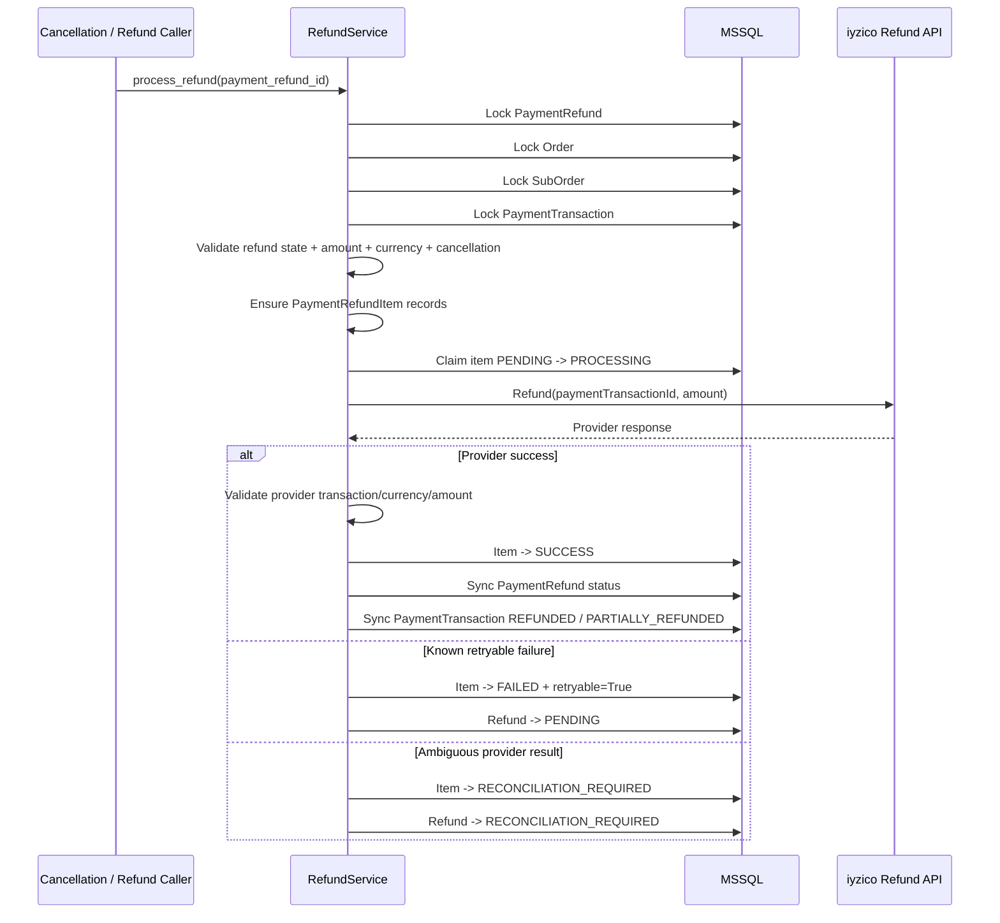

# Refund Sequence

```mermaid
sequenceDiagram
    participant C as Cancellation / Refund Caller
    participant R as RefundService
    participant DB as MSSQL
    participant I as iyzico Refund API

    C->>R: process_refund(payment_refund_id)
    R->>DB: Lock PaymentRefund
    R->>DB: Lock Order
    R->>DB: Lock SubOrder
    R->>DB: Lock PaymentTransaction
    R->>R: Validate refund state + amount + currency + cancellation
    R->>R: Ensure PaymentRefundItem records
    R->>DB: Claim item PENDING -> PROCESSING

    R->>I: Refund(paymentTransactionId, amount)
    I-->>R: Provider response

    alt Provider success
        R->>R: Validate provider transaction/currency/amount
        R->>DB: Item -> SUCCESS
        R->>DB: Sync PaymentRefund status
        R->>DB: Sync PaymentTransaction REFUNDED / PARTIALLY_REFUNDED
    else Known retryable failure
        R->>DB: Item -> FAILED + retryable=True
        R->>DB: Refund -> PENDING
    else Ambiguous provider result
        R->>DB: Item -> RECONCILIATION_REQUIRED
        R->>DB: Refund -> RECONCILIATION_REQUIRED
    end
```
