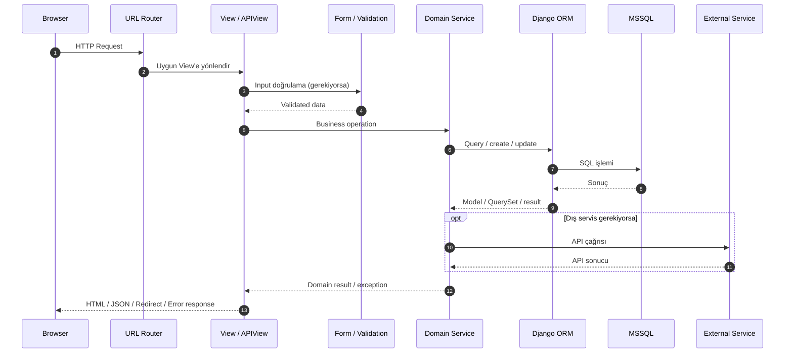

# Request Lifecycle Diyagramı

## Temel prensip

View; HTTP'nin dilini, service ise domain'in dilini konuşur. Böylece business logic'in doğrudan template veya HTTP response üretmesine bağımlı olması azaltılır.
