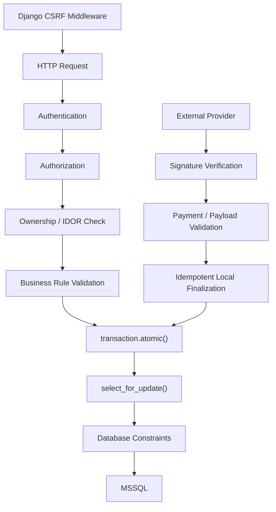

# Security Architecture

```mermaid
flowchart TD
    R["HTTP Request"] --> AUTH["Authentication"]

    AUTH --> AUTHZ["Authorization"]
    AUTHZ --> OWN["Ownership / IDOR Check"]

    OWN --> BR["Business Rule Validation"]
    BR --> TX["transaction.atomic()"]
    TX --> LOCK["select_for_update()"]

    LOCK --> CONSTRAINT["Database Constraints"]
    CONSTRAINT --> DB["MSSQL"]

    EXT["External Provider"] --> SIG["Signature Verification"]
    SIG --> PAYVAL["Payment / Payload Validation"]
    PAYVAL --> IDEMP["Idempotent Local Finalization"]
    IDEMP --> TX

    CSRF["Django CSRF Middleware"] --> R
```

Ana fikir:

> Bir güvenlik kontrolünün başarısız olması durumunda sonraki savunma katmanları mümkün olduğunca ikinci bir engel oluşturur.
