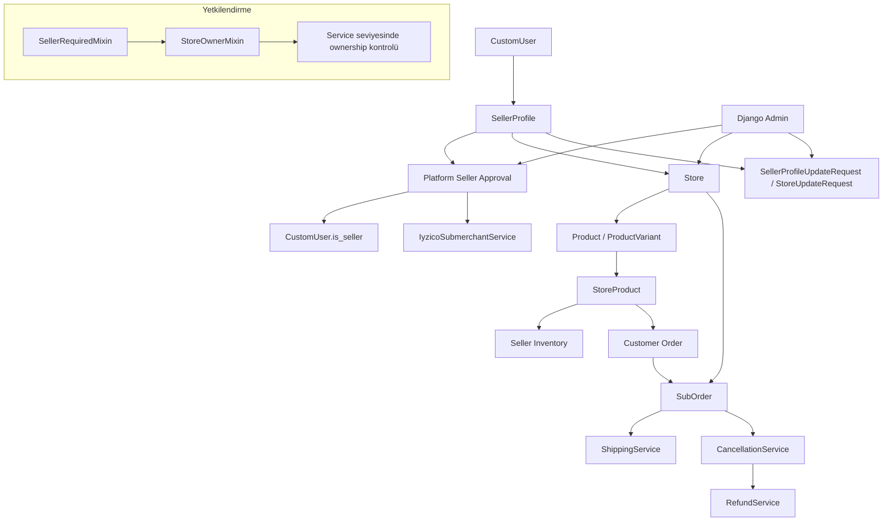

# Seller Architecture Diagram

## Katmanların anlamı

- `SellerProfile`: satıcı kimliği ve platforma ait seller bilgileri
- `Store`: seller'ın operasyon yaptığı mağaza
- `StoreProduct`: mağazanın katalog ürünü için satış teklifi
- `SubOrder`: seller açısından yönetilen sipariş birimi
- Admin: platform operasyonlarının yürütüldüğü yönetim alanı
