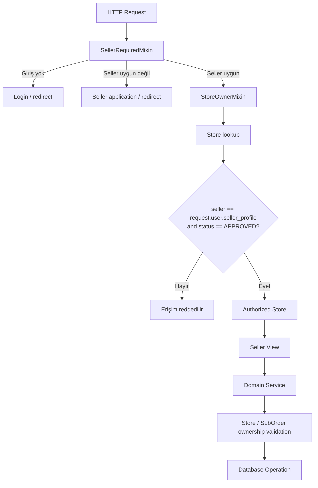

# Seller Authorization / Ownership



## Seller erişim sınırı

```text
User
  │
  ├── SellerProfile
  │
  └── Approved Store
           │
           └── Seller operations
                  ├── Inventory
                  ├── Offers
                  ├── Product Wizard
                  ├── Questions
                  └── Orders
```

Ana prensip:

> URL'de bir `store_slug` veya `suborder_number` bulunması tek başına yetki sağlamaz; kaydın giriş yapan seller'a ait olması ayrıca doğrulanır.
