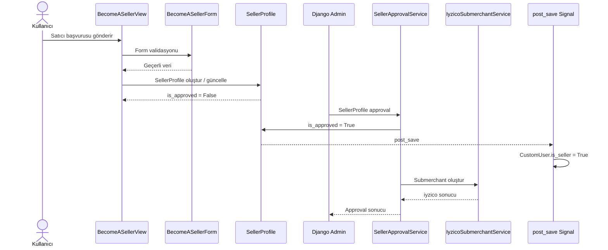
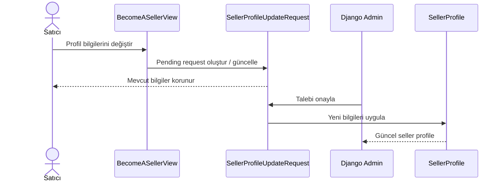

# Seller Onboarding Sequence

```mermaid
sequenceDiagram
    actor U as Kullanıcı
    participant V as BecomeASellerView
    participant F as BecomeASellerForm
    participant SP as SellerProfile
    participant A as Django Admin
    participant S as SellerApprovalService
    participant I as IyzicoSubmerchantService
    participant SG as post_save Signal

    U->>V: Satıcı başvurusu gönderir
    V->>F: Form validasyonu
    F-->>V: Geçerli veri
    V->>SP: SellerProfile oluştur / güncelle
    SP-->>V: is_approved = False

    A->>S: SellerProfile approval
    S->>SP: is_approved = True
    SP-->>SG: post_save
    SG->>SG: CustomUser.is_seller = True

    S->>I: Submerchant oluştur
    I-->>S: iyzico sonucu
    S-->>A: Approval sonucu
```

## Onaylanmış profilin güncellenmesi

```mermaid
sequenceDiagram
    actor S as Satıcı
    participant V as BecomeASellerView
    participant R as SellerProfileUpdateRequest
    participant A as Django Admin
    participant P as SellerProfile

    S->>V: Profil bilgilerini değiştir
    V->>R: Pending request oluştur / güncelle
    R-->>S: Mevcut bilgiler korunur

    A->>R: Talebi onayla
    R->>P: Yeni bilgileri uygula
    P-->>A: Güncel seller profile
```
