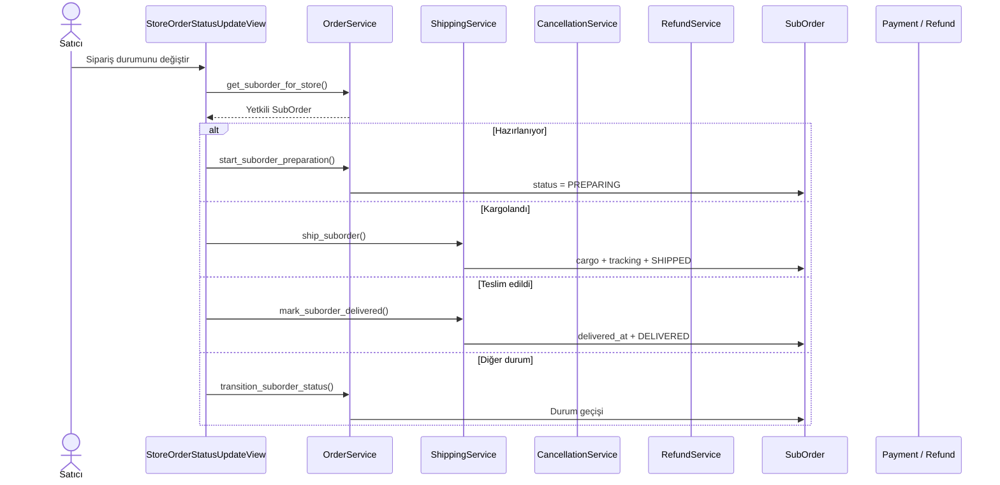
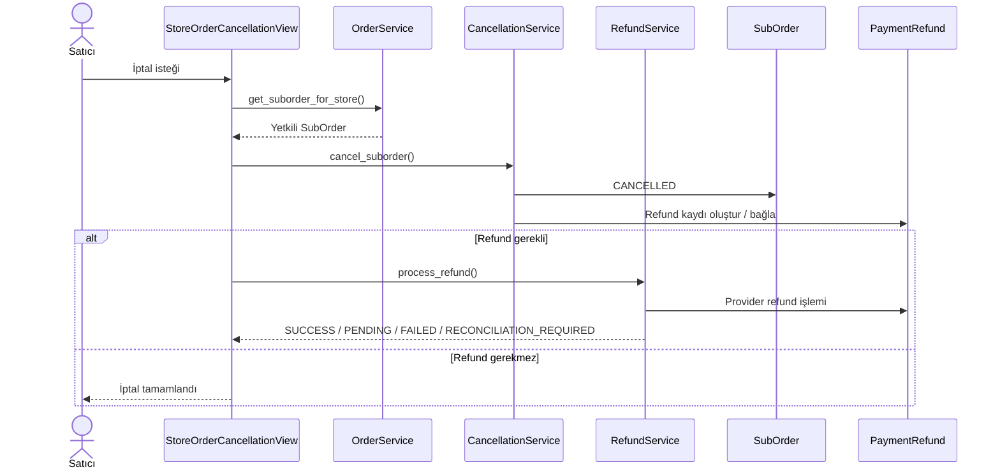

# Seller Order Flow

```mermaid
sequenceDiagram
    actor S as Satıcı
    participant V as StoreOrderStatusUpdateView
    participant OS as OrderService
    participant SS as ShippingService
    participant CS as CancellationService
    participant RS as RefundService
    participant SO as SubOrder
    participant PT as Payment / Refund

    S->>V: Sipariş durumunu değiştir
    V->>OS: get_suborder_for_store()
    OS-->>V: Yetkili SubOrder

    alt Hazırlanıyor
        V->>OS: start_suborder_preparation()
        OS->>SO: status = PREPARING
    else Kargolandı
        V->>SS: ship_suborder()
        SS->>SO: cargo + tracking + SHIPPED
    else Teslim edildi
        V->>SS: mark_suborder_delivered()
        SS->>SO: delivered_at + DELIVERED
    else Diğer durum
        V->>OS: transition_suborder_status()
        OS->>SO: Durum geçişi
    end
```

## Seller cancellation

```mermaid
sequenceDiagram
    actor S as Satıcı
    participant V as StoreOrderCancellationView
    participant OS as OrderService
    participant CS as CancellationService
    participant RF as RefundService
    participant SO as SubOrder
    participant PR as PaymentRefund

    S->>V: İptal isteği
    V->>OS: get_suborder_for_store()
    OS-->>V: Yetkili SubOrder

    V->>CS: cancel_suborder()
    CS->>SO: CANCELLED
    CS->>PR: Refund kaydı oluştur / bağla

    alt Refund gerekli
        V->>RF: process_refund()
        RF->>PR: Provider refund işlemi
        RF-->>V: SUCCESS / PENDING / FAILED / RECONCILIATION_REQUIRED
    else Refund gerekmez
        V-->>S: İptal tamamlandı
    end
```
