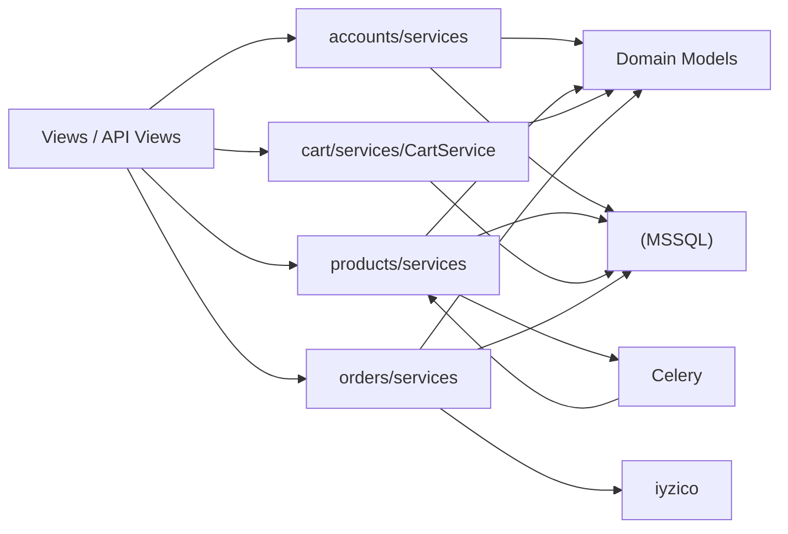

# Service Layer Diyagramı

## Ana service grupları

### `accounts/services`

- `SellerApprovalService`

### `products/services`

- draft/create/update
- image management
- variant management
- matching
- offer creation / publishing
- storefront
- search/indexing
- review / QA / collections ile ilgili işlemler

### `cart/services`

- `CartService`

### `orders/services`

- `OrderService`
- `PaymentService`
- `CardStorageService`
- `RefundService`
- `Cancellation` servisleri
- `ShippingService`
- `InvoiceService`
- `StockReservationService`
- `IyzicoSubmerchantService`
