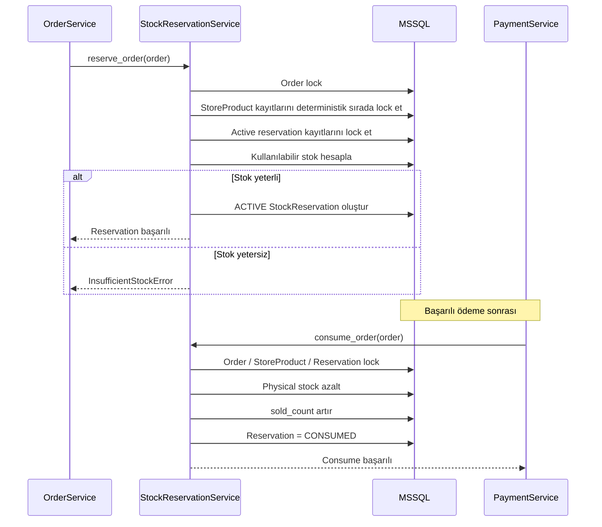

# Stock Reservation Sequence

```mermaid
sequenceDiagram
    participant Order as OrderService
    participant Stock as StockReservationService
    participant DB as MSSQL
    participant Payment as PaymentService

    Order->>Stock: reserve_order(order)
    Stock->>DB: Order lock
    Stock->>DB: StoreProduct kayıtlarını deterministik sırada lock et
    Stock->>DB: Active reservation kayıtlarını lock et
    Stock->>DB: Kullanılabilir stok hesapla

    alt Stok yeterli
        Stock->>DB: ACTIVE StockReservation oluştur
        Stock-->>Order: Reservation başarılı
    else Stok yetersiz
        Stock-->>Order: InsufficientStockError
    end

    Note over Payment,DB: Başarılı ödeme sonrası
    Payment->>Stock: consume_order(order)
    Stock->>DB: Order / StoreProduct / Reservation lock
    Stock->>DB: Physical stock azalt
    Stock->>DB: sold_count artır
    Stock->>DB: Reservation = CONSUMED
    Stock-->>Payment: Consume başarılı
```
