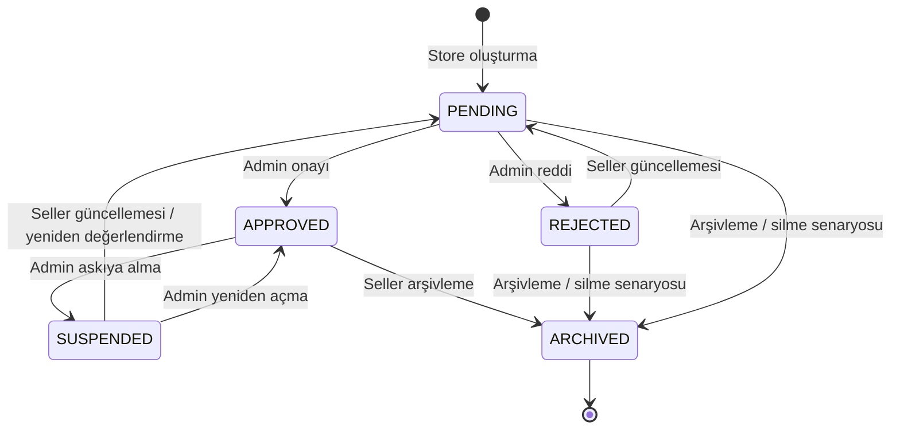
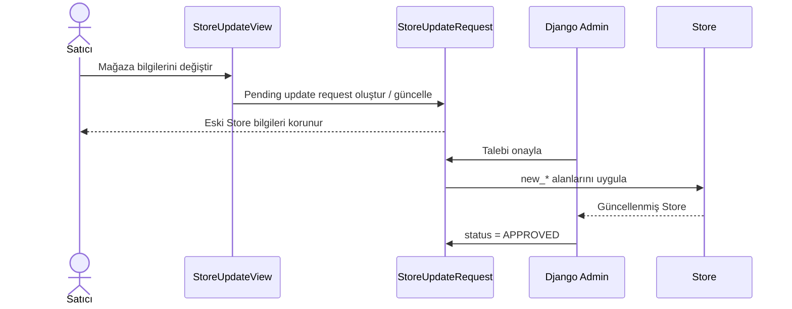

# Store Lifecycle

```mermaid
stateDiagram-v2
    [*] --> PENDING: Store oluşturma

    PENDING --> APPROVED: Admin onayı
    PENDING --> REJECTED: Admin reddi

    REJECTED --> PENDING: Seller güncellemesi

    APPROVED --> SUSPENDED: Admin askıya alma
    SUSPENDED --> PENDING: Seller güncellemesi / yeniden değerlendirme
    SUSPENDED --> APPROVED: Admin yeniden açma

    APPROVED --> ARCHIVED: Seller arşivleme
    REJECTED --> ARCHIVED: Arşivleme / silme senaryosu
    PENDING --> ARCHIVED: Arşivleme / silme senaryosu

    ARCHIVED --> [*]
```

## Onaylı mağazada bilgi güncelleme

```mermaid
sequenceDiagram
    actor S as Satıcı
    participant V as StoreUpdateView
    participant R as StoreUpdateRequest
    participant A as Django Admin
    participant ST as Store

    S->>V: Mağaza bilgilerini değiştir
    V->>R: Pending update request oluştur / güncelle
    R-->>S: Eski Store bilgileri korunur

    A->>R: Talebi onayla
    R->>ST: new_* alanlarını uygula
    ST-->>A: Güncellenmiş Store
    A->>R: status = APPROVED
```
