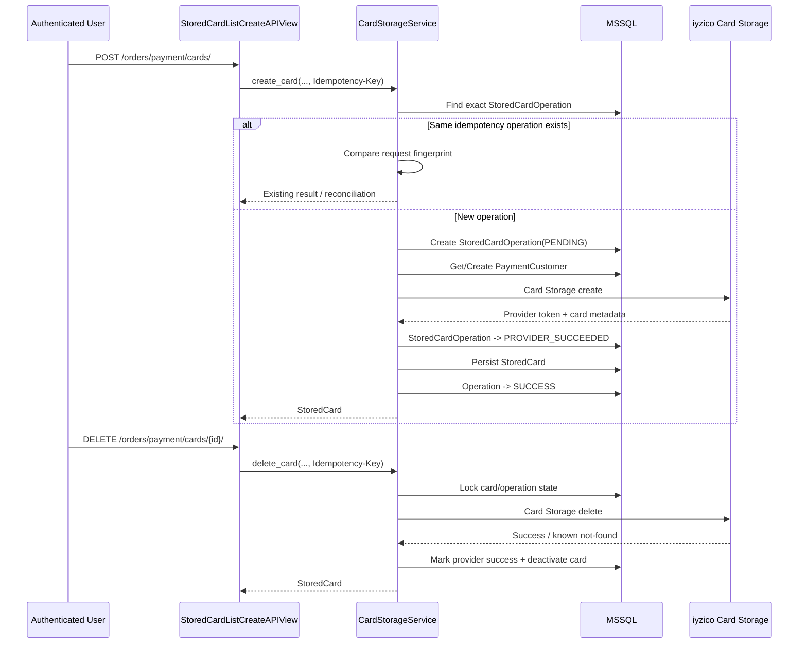

# Stored Card Sequence

```mermaid
sequenceDiagram
    participant U as Authenticated User
    participant V as StoredCardListCreateAPIView
    participant S as CardStorageService
    participant DB as MSSQL
    participant I as iyzico Card Storage

    U->>V: POST /orders/payment/cards/
    V->>S: create_card(..., Idempotency-Key)
    S->>DB: Find exact StoredCardOperation

    alt Same idempotency operation exists
        S->>S: Compare request fingerprint
        S-->>V: Existing result / reconciliation
    else New operation
        S->>DB: Create StoredCardOperation(PENDING)
        S->>DB: Get/Create PaymentCustomer
        S->>I: Card Storage create
        I-->>S: Provider token + card metadata
        S->>DB: StoredCardOperation -> PROVIDER_SUCCEEDED
        S->>DB: Persist StoredCard
        S->>DB: Operation -> SUCCESS
        S-->>V: StoredCard
    end

    U->>V: DELETE /orders/payment/cards/{id}/
    V->>S: delete_card(..., Idempotency-Key)
    S->>DB: Lock card/operation state
    S->>I: Card Storage delete
    I-->>S: Success / known not-found
    S->>DB: Mark provider success + deactivate card
    S-->>V: StoredCard
```
