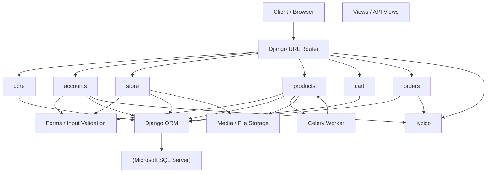

# Sistem Mimarisi Diyagramı

> GitHub'ın normal Markdown görünümünde aşağıdaki Mermaid diyagramı kutular ve bağlantılar şeklinde render edilir. `Raw` görünümünde ise Mermaid kaynak kodu görülür.

## Notlar

- `Client / Browser`, uygulamanın kullanıcı arayüzünü temsil eder; ayrı bir SPA frontend'i olarak modellenmemiştir.
- `Views / API Views`, HTML sayfaları ile JSON endpoint'lerini birlikte temsil eder.
- `Services`, domain servisleri uygulama içinde ilgili app'lerin altında bulunur. Diyagramın sade kalması için her service dosyası ayrı kutu yapılmamıştır.
- `iyzico` ödeme/sub-merchant/card/refund gibi dış servis entegrasyonlarını temsil eder.
- `Celery Worker`, mevcut async ürün görseli kopyalama task'ını temsil eder.
- `Media / File Storage`, Django `MEDIA_ROOT` tabanlı medya dosyalarını temsil eder; production storage topolojisi kaynak koddan kesinleştirilmemiştir.
