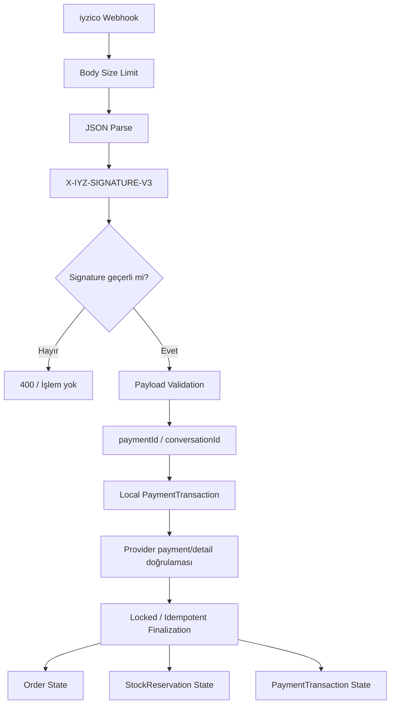

# iyzico Webhook Security

```mermaid
flowchart TD
    W["iyzico Webhook"] --> SIZE["Body Size Limit"]
    SIZE --> JSON["JSON Parse"]
    JSON --> HEADER["X-IYZ-SIGNATURE-V3"]

    HEADER --> VERIFY{"Signature geçerli mi?"}

    VERIFY -->|Hayır| REJECT["400 / İşlem yok"]
    VERIFY -->|Evet| VALIDATE["Payload Validation"]

    VALIDATE --> PID["paymentId / conversationId"]
    PID --> LOCAL["Local PaymentTransaction"]

    LOCAL --> DETAIL["Provider payment/detail doğrulaması"]
    DETAIL --> FINAL["Locked / Idempotent Finalization"]

    FINAL --> ORDER["Order State"]
    FINAL --> RES["StockReservation State"]
    FINAL --> PAYMENT["PaymentTransaction State"]
```

Webhook endpoint'i `csrf_exempt` olsa da güvenlik mekanizması kaldırılmış değildir; CSRF yerine provider signature + payment reconciliation kullanılır.
